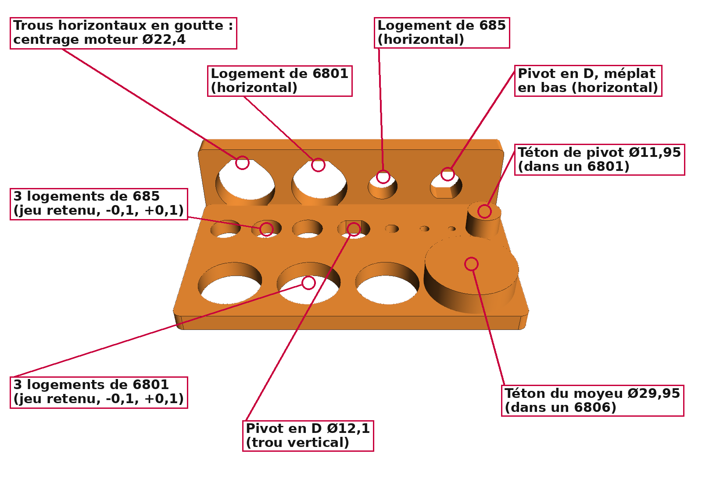
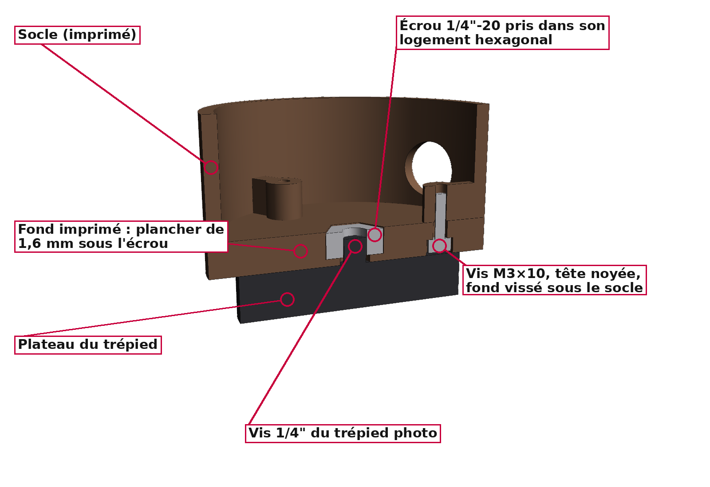
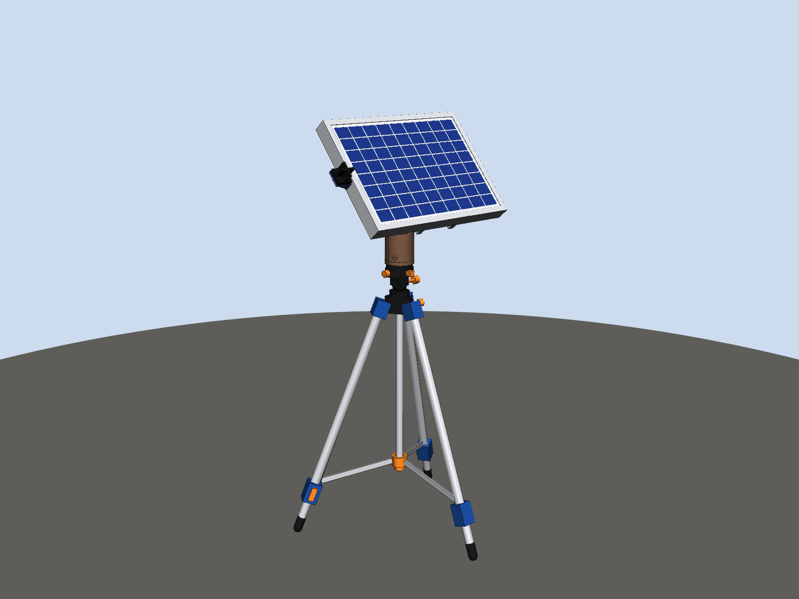
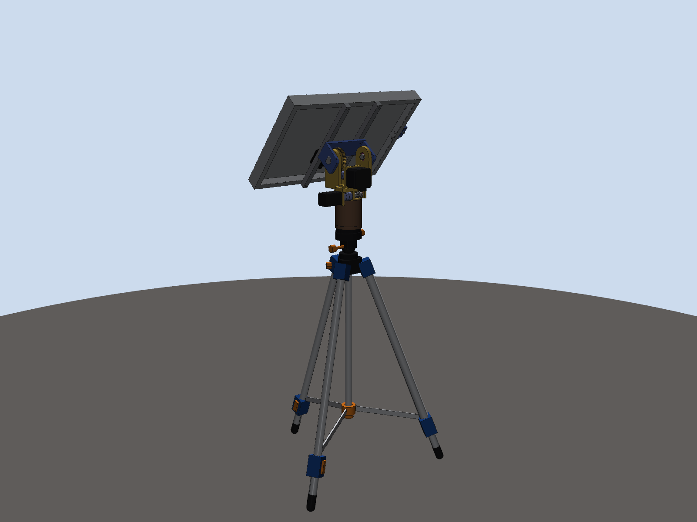
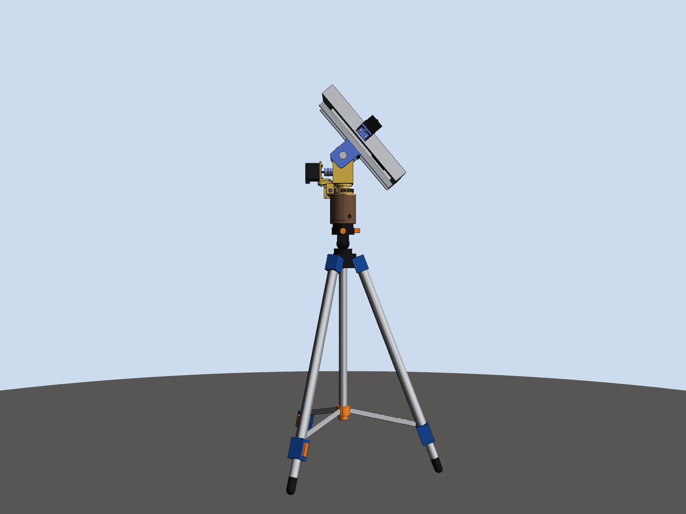
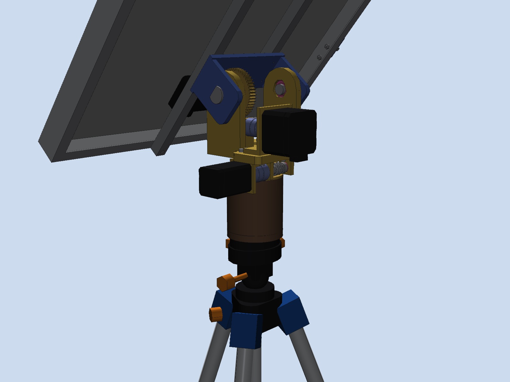
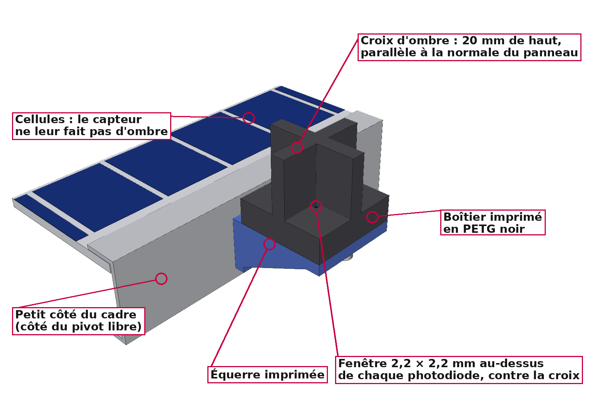
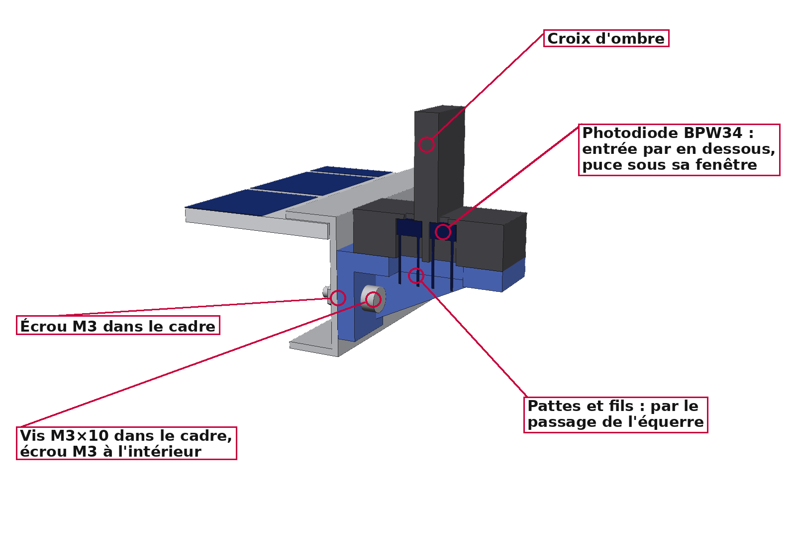

# Tracker solaire lunaire deux axes — maquette 3D à l'échelle 1:1

Maquette CAO d'un tracker solaire destiné à la surface de la Lune. Elle comprend :
* un trépied déployable ;
* une **tête rotative à vis sans fin** (azimut + élévation, deux petits moteurs pas à pas
  pilotés par un ESP32) ;
* **le panneau photovoltaïque de 356 × 253 × 30 mm**, avec son **capteur solaire** (4
  photodiodes sous une croix d'ombre, § 13) ;
* un faisceau de câbles et une unité de contrôle posée au sol.

Les deux vis sans fin sont **irréversibles** : la tête tient le panneau dans toutes les
positions **moteurs coupés**, sans contrepoids, sur Terre comme sur la Lune.
Toutes les cotes sont en **millimètres, à taille réelle**.

| Vue d'ensemble (panneau à 40°) | Tête rotative à vis sans fin |
|---|---|
|  |  |
|  |  |

---

## 1. Fichiers

| Fichier | Contenu |
|---|---|
| **`CAO/Cas_Reel/`** | **Cas réel** (Lune), cotes nominales : |
| `CAO/Cas_Reel/Tracker_Lunaire_PoleSud.step` | **Assemblage principal** : pose de fonctionnement au pôle Sud (site Artemis), Soleil à +1,5°, panneau quasi vertical |
| `CAO/Cas_Reel/Tracker_Lunaire_LatitudeMoyenne.step` | Même assemblage, pose « sites Apollo » : Soleil à 50°, panneau incliné à 40° |
| `CAO/Cas_Reel/Tete_Rotative_VisSansFin.step` | La tête rotative seule, avec le haut de la colonne et le panneau monté à 40° |
| `CAO/Cas_Reel/pieces/*.step` | Toutes les pièces seules (trépied, tête, panneau, unité au sol), chacune dans son repère de construction |
| **`CAO/Demo_Terre_PETG/`** | **Démonstration sur Terre**, tête imprimée en 3D en PETG, avec les jeux d'ajustement (voir § 12) : |
| `CAO/Demo_Terre_PETG/a_imprimer/*.stl` (et `.step`) | Les 18 pièces à imprimer (16 pour la tête, 2 pour le capteur solaire), déjà orientées et posées sur le plateau |
| `CAO/Demo_Terre_PETG/Tete_Rotative_PETG.step` | L'assemblage de la tête imprimée (avec roulements, arbres Ø5, moteurs et vis), pour vérifier le montage |
| `CAO/Demo_Terre_PETG/Eprouvette_Ajustements.stl` | Éprouvette à imprimer en premier pour régler les ajustements sur ton imprimante |
| `CAO/Demo_Terre_PETG/Demo_Trepied_Dexter.step` | La démonstration complète sur ton trépied photo Dexter : tête PETG, panneau, capteur solaire et trépied (§ 12) |
| `docs/bilan_masse.csv` | Bilan de masse pièce par pièce (séparateur `;`, s'ouvre dans Excel) |
| `docs/apercu_*.png`, `docs/tete_vis_sans_fin_*.png`, `docs/demo_trepied_dexter_*.png` | Rendus du tracker (iso, face, profil, arrière, détails), de la tête seule (dont deux coupes) et de la démonstration sur le trépied Dexter |
| **`LISTE_ACHATS.md`** | **Liste d'achats** de la démonstration sur Terre : roulements, accouplements, arbres Ø5 des vis sans fin, moteurs, électronique, visserie, consommables, avec les noms à chercher et les quantités |
| `docs/explications/*.png` | Images annotées pour le montage : palier d'une vis sans fin (joues, roulements, arbre), vis sans fin imprimée (filet, moyeux, vis de blocage) axe d'élévation imprimé (pivots, roulements 6801, roue), éprouvette de réglage des ajustements, fond sur trépied photo, capteur solaire (vue et coupe) |
| `docs/optimisation_angle_jambes.md` | Optimisation de l'angle φ des jambes : exigences, résultats angle par angle, sensibilité |
| `generate_tracker.py` | Script paramétrique qui génère toute la CAO, le bilan de masse et les contrôles |
| `generate_tete_vis_sans_fin.py` | Exporte la tête seule, cale les vis, calcule les couples et la tenue moteurs coupés |
| `generate_demo_trepied.py` | Monte la tête PETG sur le trépied Dexter, vérifie les interférences et calcule la stabilité (basculement, vent) |
| `optimisation_angle.py` | Calcule l'angle φ optimal des jambes à partir des masses de la CAO |
| `render_apercu.py`, `render_tete_vis_sans_fin.py`, `render_explications.py` | Génèrent les rendus PNG et les images annotées |

### Ouvrir dans SolidWorks

Un fichier SolidWorks natif (`.SLDASM` / `.SLDPRT`) ne peut être écrit que par SolidWorks
lui-même. Le format STEP AP214 fourni s'ouvre directement comme un assemblage complet,
avec les noms des pièces, les sous-assemblages et les couleurs.

1. **Fichier › Ouvrir**, type *STEP AP203/214/242 (\*.step; \*.stp)*, puis choisir
   `CAO/Cas_Reel/Tracker_Lunaire_PoleSud.step`.
2. Si SolidWorks demande un modèle de document, prendre l'assemblage et la pièce **en mm**.
3. **Fichier › Enregistrer sous › Assemblage (\*.sldasm)**. Au premier enregistrement,
   SolidWorks crée les fichiers `.SLDPRT` de chaque pièce.
   Pour tout regrouper dans un dossier, utiliser **Fichier › Pack and Go**.

Repère : **Y vertical**, c'est-à-dire que le plan de dessus de SolidWorks correspond au sol.
* L'origine est au sol, sur l'axe d'azimut (**axe Y**).
* L'axe d'élévation est horizontal (**axe X** dans la pose de référence), à Y = 700 mm.
  Le sommet de la colonne, sur lequel repose la tête, est à Y = 544 mm.
* Les pièces arrivent fixes, sans contraintes. Pour animer le tracker :
  * libérer `SA_Tete_Orientable` et ajouter une contrainte coaxiale entre le moyeu de la `Chape` et les `Roulement_6806` ;
  * libérer `SA_Panneau` et ajouter une contrainte coaxiale entre les pivots (`Pivot_Entraine`, `Pivot_Libre`) et les `Roulement_608` (`Roulement_6801` dans la version PETG) ;
  * ajouter des contraintes d'engrenage entre `Vis_Azimut` et `Roue_Azimut_Fixe` (rapport 1:60), puis entre `Vis_Elevation` et `Roue_Elevation` (1:50).

Arborescence :

```
Tracker_Lunaire_PoleSud
├── SA_Trepied            colonne, colliers, 3 × Jambe_n, 3 × entretoises, 3 × patins, 3 × vis d'ancrage
├── SA_Tete_Fixe          fond et socle Ø62, 2 roulements 6806, roue d'azimut fixe (bronze)
├── SA_Tete_Orientable    chape en U (jaune), vis + moteur d'azimut, vis + moteur d'élévation,
│   │                     paliers, accouplements, roulements                                  ← tourne en azimut (Y)
│   └── SA_Panneau        chapeau en U renversé (bleu), pivots, roue d'élévation (bronze),
│                         2 rails, cadre, laminé, cellules, boîte de jonction                 ← tourne en élévation (X)
├── SA_Unite_Sol          unité de contrôle / batterie + radiateur
└── SA_Faisceau           faisceau de câbles
```

---

## 2. Tête rotative à vis sans fin

| Tête seule | Coupe : vis et roue d'élévation |
|---|---|
|  |  |
|  |  |
|  |  |

| Coupe par les axes (cas réel) : roulements en rose (6806 dans le socle, 608 dans les bras) |
|---|
|  |

### Architecture

La tête est un **mécanisme de pointage bi-axe azimut-élévation (AE)** : un axe vertical pour
tourner (azimut), un axe horizontal porté par lui pour incliner (élévation), et une fourche
(la chape) qui porte le panneau. Le choix de ce schéma est expliqué au § 14, avec l'article
qui l'a guidé.

| Élément | Choix |
|---|---|
| **Socle** (brun) | Cylindre Ø62 posé sur la colonne du trépied, centré dedans par le fond et bloqué en rotation par une vis M3 radiale à travers la colonne (version PETG : fond vissé sur la vis 1/4" d'un trépied photo, § 12). Il porte deux **roulements 6806** (Ø30/Ø42 × 7) et la **roue d'azimut, fixe**, posée à plat sur le socle et tenue par 3 vis M3 fraisées affleurantes, sous le passage de la vis d'azimut. Un passe-câble est orienté vers l'unité au sol |
| **Chape en U** (jaune) | Tourne en azimut sur les deux 6806. Sa plaque porte les **deux moteurs** et les deux vis. Ses bras portent les roulements de l'axe d'élévation (608 ; 6801 en version imprimée), à 156 mm au-dessus de la colonne (700 mm du sol) |
| **Chapeau en U renversé** (bleu) | Coiffe la chape. Il pivote sur deux pivots dans les roulements des bras et porte les deux rails du panneau. Cas réel : axes inox Ø8 sur 608. Démonstration : pivots **imprimés en PETG, Ø12**, sur 6801 (§ 12). Un **bossage** sur chaque flanc appuie sur la bague intérieure du roulement et règle le jeu axial |
| **Azimut (axe Y)** | **NEMA 11 de 45 mm** + vis sans fin m0,8 Ø12 sur la **roue bronze Z60 fixée sur le socle** : **60:1**. La vis roule autour de la roue, comme sur une tourelle. Le moteur tourne donc avec le panneau et ne se trouve jamais sur son chemin |
| **Élévation (axe X)** | **NEMA 17 de 34 mm** + vis sans fin m1 Ø16 sur la **roue bronze Z50** calée sur le pivot gauche du chapeau : **50:1**. Le moteur est à l'arrière de la chape, du côté opposé au panneau |
| **Vis** | Chaque vis tourne sur son arbre Ø5, porté par deux roulements 685. Ses deux moyeux appuient sur les bagues intérieures des 685, et une **lèvre** de chaque joue du palier retient leur bague extérieure : la poussée axiale de la vis va au palier. Un accouplement flexible la relie au moteur, si bien que le moteur ne reçoit pas cette poussée |
| **Liaison au panneau** | Deux rails 12 × 13 vissés sur le dessus du chapeau (4 × M3, par-dessus) et sur l'aile arrière du cadre (4 × M3 par-dessous, écrous dans le cadre). Le dos du cadre est à 46 mm de l'axe d'élévation |
| **Passage des câbles** | Les câbles descendent par le moyeu creux de la chape, font une boucle dans le socle et sortent par le passe-câble |
| **Fixations** | Vis CHC M3 (M2,5 pour le NEMA 11), toutes modélisées. Chaque tête de vis est accessible, et aucune n'est sur le passage d'une pièce mobile. Le palier et le support du moteur d'azimut sont vissés à travers des **lumières** de la chape : on règle l'engrènement de la vis d'azimut en les faisant glisser |

### Roulements (en rose dans les fichiers 3D et les aperçus)

Tous les roulements sont **protégés** des deux côtés : flasques métalliques (**ZZ**,
conseillé) ou joints caoutchouc (**2RS**). Leurs cotes sont celles des roulements ouverts,
sauf pour le 685. Dans les fichiers 3D, la protection est l'anneau en retrait de 0,2 mm sur
chaque face.

| Réf. | Dimensions (Ø int. × Ø ext. × largeur) | Qté | Emplacement |
|---|---|---|---|
| **6806** (ISO 61806) | 30 × 42 × 7 mm | 2 | Azimut : dans le socle, autour du moyeu de la chape |
| **608** | 8 × 22 × 7 mm | 2 | Élévation, **cas réel** : dans les bras de la chape, sur les axes Ø8 du chapeau |
| **6801** (ISO 61801) | 12 × 21 × 5 mm | 2 | Élévation, **démonstration PETG** : remplace les 608, sur les pivots imprimés Ø12 |
| **685ZZ** ou **685-2RS** | 5 × 11 × 5 mm | 4 | Arbres des deux vis sans fin, deux par vis, dans les paliers |

**Aucune pièce ne touche la protection.** Une pièce qui tourne avec l'arbre n'appuie que sur la
bague intérieure, et une pièce fixe que sur la bague extérieure. Sinon, une pièce frotterait
sur la flasque ou sur le joint, ou bien une pièce fixe freinerait la bague qui tourne.

| Roulement | Appui sur la bague intérieure (Ø maxi) | Appui sur la bague extérieure (Ø mini) |
|---|---|---|
| 6806 (azimut) | Collerette du moyeu et rondelle d'arrêt : **Ø33** | Épaulement du socle entre les deux roulements, et dessous de la roue d'azimut : alésage **Ø40** |
| 608 / 6801 (élévation) | Bossage de chaque flanc du chapeau : **Ø11,5 / Ø14,2**, à 0,1 / 0,25 mm de la bague | Épaulement du bras de la chape : alésage **Ø19,8 / Ø19,5** |
| 685 (vis) | Épaulement de chaque moyeu de la vis : **Ø6,5**, à 0,15 mm de la bague | Lèvre de 1 mm de chaque joue du palier : alésage **Ø9,8** |

`generate_tete_vis_sans_fin.py` le vérifie à chaque génération, pour les deux versions. Il
contrôle les deux faces de chaque roulement : rien à moins de 0,3 mm de la protection, et
chaque bague n'est approchée que par ce qui tourne avec elle.

* **685** : prendre une version **protégée, ZZ ou 2RS**. Le 685 ouvert ne fait que 3 mm de
  large, alors que les paliers sont prévus pour 5 mm.
* **Démonstration sur Terre** : roulements acier standard, de préférence **ZZ**. Ils sont
  graissés à vie d'origine : ne pas les ouvrir ni les regraisser.
  * Les joints des 2RS frottent sur la bague intérieure. Les deux 6806-2RS freinent
    l'azimut d'environ 0,15 N·m (estimation), soit le tiers du couple du vent de 10 m/s.
  * Avec des 2RS, la marge de l'azimut au vent passe de ×2,3 à ×1,6 (vis graissée), et
    au-dessous de ×1 si la vis tourne à sec.
  * L'élévation n'est presque pas touchée : ×2,7 → ×2,6.
* **Montage** : enfoncer un roulement en poussant sur la bague qu'on emmanche. Dans un
  logement, c'est la bague extérieure : utiliser une douille de son diamètre, jamais un
  outil posé sur la flasque.
* **Cas réel (Lune)** : mêmes dimensions, en acier 440C, version **ZZ**. Les flasques
  métalliques arrêtent la poussière de régolithe sans frotter. La lubrification est sèche
  (MoS₂) : ni joint caoutchouc ni graisse, qui dégazeraient dans le vide.

**Pourquoi une vis sans fin.** Sans contrepoids, le panneau est forcément décentré : il doit
passer devant la chape pour devenir vertical. Son poids crée donc un couple sur l'axe
d'élévation, jusqu'à 0,95 N·m sur Terre. La vis sans fin est **irréversible** :
* le moteur fait tourner la roue ;
* la roue ne peut pas faire tourner la vis, parce que la pente du filet (3,6°) est plus
  faible que l'angle de frottement (environ 6°). C'est le principe du cric de voiture à vis.

Le panneau tient donc seul dans toutes les positions, même dans le vent et même en cas de
coupure de courant. Les moteurs ne sont alimentés que pendant les mouvements.

### Moteurs

| Axe | Moteur | Caractéristiques |
|---|---|---|
| Élévation | **NEMA 17, 42 × 42 × 34 mm** (17HS3401 Usongshine) | 0,34 N·m, 1,0 A (0,6 A en version PETG), axe Ø5 × 23,5 à méplat, connecteur JST PH 6 broches, ≈ 0,22 kg |
| Azimut | **NEMA 11, 28 × 28 × 45 mm** (type 11HS18-0674S) | 0,10 N·m (0,095 retenu dans les calculs, par prudence), 0,67 A, 6,8 Ω, 0,18 kg, axe Ø5 × 20 à méplat |

Modèle retenu pour l'élévation : **Usongshine 17HS3401, 0,34 N·m à 1,0 A**. Son plan est
vérifié : taraudages M3 profonds de 4,5 mm au moins, centrage Ø22 × 2, trous à 31 mm, axe
Ø5 × 23,5. Un autre 17HS3401 convient s'il est annoncé à **0,28 N·m au moins**. Certains
vendeurs vendent sous la même référence une version à 0,23 N·m, trop juste. En version
PETG, régler le courant pour obtenir environ 0,20 N·m de maintien (0,6 A pour ce moteur).

### Couples : besoins et marges dans tous les cas

Les besoins sont calculés par `generate_tete_vis_sans_fin.py` à partir de la CAO :
* partie basculante (chapeau, roue, rails, panneau, capteur solaire) : 1,73 kg, dont 1,16 kg
  de panneau (pesé) et 0,06 kg de capteur solaire ;
* centre de gravité à 55,7 mm de l'axe, puisqu'il n'y a pas de contrepoids ;
* couple de gravité maximal (panneau vertical) : 0,95 N·m sur Terre et 0,16 N·m sur la Lune ;
* frottements : 0,01 N·m en élévation et 0,02 N·m en azimut ;
* vent de 10 m/s (36 km/h), sur Terre en extérieur. La pression dynamique vaut 60 Pa, soit
  environ 6,5 N sur le panneau. Le centre de poussée est décalé de 5 à 8 cm en vent oblique,
  ce qui donne **+0,35 N·m en élévation et 0,50 N·m en azimut**.

Le couple disponible vaut couple de maintien × 0,7 (couple en marche lente en micro-pas) ×
rapport × rendement de la vis. Le rendement d'une vis à un filet vaut 0,29 (élévation) et
0,30 (azimut), avec un frottement prudent μ = 0,15.

| Marge = disponible / besoin | Lune | Terre, intérieur | Terre, extérieur (vent 10 m/s) |
|---|---|---|---|
| Élévation (3,47 N·m disponibles, moteur à 1,0 A) | ×21 | ×3,6 | **×2,7** |
| Élévation, version PETG, moteur limité à 0,6 A (2,08 N·m) | — | ×2,3 | **×1,6** |
| Azimut (1,22 N·m disponibles) | ×61 | ×41 | **×2,3** |

* **Le cas qui dimensionne est la démonstration sur Terre en extérieur.** On y vise une
  marge d'environ 2, sans surdimensionner. Les grandes marges sur la Lune viennent de
  l'absence de vent et de la gravité six fois plus faible : le même matériel doit aussi
  faire la démonstration à 1 g.
* **Chaque moteur est le plus petit moteur courant qui convient.** Avec le moteur juste en
  dessous, la marge en vent devient insuffisante :
  * élévation : NEMA 11 de 45 mm, ×0,77 ;
  * azimut : NEMA 11 court (32 mm, ≈ 0,05 N·m), ×1,2.

### Bilan de dimensionnement : est-ce surdimensionné ?

Calculé avec le panneau pesé (1,16 kg), les masses des pièces d'après leurs matériaux, le
rendement des vis, les roulements et les câbles.

| Ce qu'on regarde | Version PETG (démonstration) | Cas réel | Verdict |
|---|---|---|---|
| Part du couple moteur utilisée, élévation | 61 % dehors (vent 10 m/s), 44 % dedans, à 0,6 A | 38 % dehors, 5 % sur la Lune, à 1,0 A | Bien dimensionné dehors ; ×21 de trop sur la Lune |
| Part du couple moteur utilisée, azimut | 43 % dehors, 2 % dedans | 43 % dehors, 2 % sur la Lune | Dimensionné par le vent ; sans vent, ×40 à ×60 de trop |
| Dents en PETG, élévation | 16 MPa en marche dehors, 37 MPa moteur calé | — | C'est la vraie limite : d'où le courant limité à 0,6 A |
| Dents en PETG, azimut | 7 MPa en marche dehors, 22 MPa moteur calé | — | Large |
| Pivot entraîné Ø12 en PETG | 4 MPa en marche, 9 MPa moteur calé | — | ×3 au calage, ×8 en marche |
| Roulements | en marche : poussée de la vis ≈ 1/5 de la capacité statique d'un 685 ; charge ≈ 1/100 de celle d'un 6806 | idem | Choisis pour leurs dimensions (câbles, axes), pas pour la charge |
| Inertie | ≈ 0,012 kg·m² basculants : < 1 % du couple de gravité même en retour rapide | idem | Négligeable |

* **Le cas qui dimensionne est la démonstration dehors, avec 10 m/s de vent.** Les marges y
  sont de ×1,6 (élévation, PETG à 0,6 A) à ×2,3. Pour un moteur pas à pas, on vise ×1,5
  à ×2 : au-delà de son couple, il ne ralentit pas, il **saute des pas** et perd sa
  position. Le couple réel varie aussi de 10 à 20 % selon le vendeur et la température.
  L'élévation de la version PETG est donc au bas de la plage, pas au-dessus.
* **Les grandes marges (intérieur, Lune) ne coûtent rien.** Le même matériel doit tenir le
  pire cas. Un moteur plus petit ne tiendrait pas le vent (voir ci-dessus). Pour une
  version de vol seulement, sans essais à 1 g, un NEMA 8 long (≈ 0,04 N·m) suffirait en
  élévation sur la Lune : il n'y faut que 0,011 N·m au moteur.
* **Vitesse** : le Soleil avance de 15°/h en moyenne sur Terre (jusqu'à ≈ 40°/h en azimut
  vers midi en été) et de 0,5°/h sur la Lune. Sur Terre, le moteur d'azimut fait donc de
  2,5 à environ 7 tours par heure, et celui d'élévation au plus 2,1. À cette vitesse, un
  pas à pas donne tout son couple, et la puissance mécanique à l'axe est de l'ordre de
  0,1 mW.
* **Pertes** : chaque vis perd 70 % du couple moteur en frottement (rendement 0,29 à
  0,30). C'est le prix de l'irréversibilité : la vis sert de frein, sans frein à acheter ni
  courant de maintien. Les roulements et les câbles ne coûtent que 0,01 à 0,02 N·m, soit 1 à
  4 % du besoin. Des joints 2RS ajouteraient 0,15 N·m en azimut : prendre des ZZ.
* **Énergie** : alimentés, les moteurs consomment environ 2 W (NEMA 17 à 0,6 A) et 6 W
  (NEMA 11). Comme les vis tiennent seules, les drivers sont coupés entre deux corrections.
  Avec une correction de 0,5° toutes les 2 minutes, les moteurs sont alimentés moins de 1 %
  du temps, soit quelques dizaines de mW en moyenne au lieu de 8 W.

### Tenue moteurs coupés

| Cas | Ce qui tient | Résultat |
|---|---|---|
| **Terre**, vis graissées (μ ≈ 0,10) | La vis se bloque : hélice de 3,6° (élévation) et 3,8° (azimut), angle de frottement 5,7° | **Tient dans toutes les positions, même dans le vent** |
| Terre, frottement réduit par des vibrations (μ ≈ 0,05) | La vis peut redevenir réversible. Le couple résiduel du moteur coupé (valeurs typiques : 0,016 N·m pour le NEMA 17, 0,005 N·m pour le NEMA 11) prend le relais | Tient : ×3,1 en élévation, ×2,4 en azimut |
| **Lune**, MoS₂ sous vide (μ ≈ 0,02) | La vis est réversible, mais la gravité ne donne que 0,16 N·m et il n'y a pas de vent | **Tient** : ×7,5 en élévation par le couple résiduel du moteur. En azimut, rien ne pousse |

Conséquences :
* **Aucun courant à l'arrêt** : drivers désactivés entre deux mouvements, donc consommation
  nulle. Le suivi consomme moins de 0,5 Wh par jour, ce qui compte pour la nuit lunaire de
  14 jours.
* **Pas de surchauffe dans le vide**, puisque les moteurs sont presque toujours coupés.
* **La position n'est pas perdue** : au réveil, le moteur bouge au plus d'un pas, soit
  0,036° au panneau.
* **Ne jamais forcer le panneau à la main** : on forcerait directement sur les dents de la
  roue en bronze. Pour le bouger, alimenter le moteur ou tourner l'arbre de la vis.

### Limites de vent (sur Terre)

| | Limite |
|---|---|
| Tourner sans perdre de pas | environ 24 m/s en élévation, **environ 15 m/s (55 km/h) en azimut** |
| Tenir moteurs coupés | environ 30 m/s : au-delà, ce sont les dents de bronze qui limitent |
| **Trépied non ancré** (pire orientation) | **basculement vers 16 m/s (58 km/h)** |

Au-delà d'environ 15 m/s, c'est le trépied qui limite. Pour une démonstration en extérieur,
planter les vis d'ancrage ou lester les pieds. Au-dessus de 10 m/s, mettre le panneau à plat
(élévation 90°), où le vent a le moins de prise, puis couper les moteurs.

### Résolution et vitesses (moteurs à 200 pas/tour, 1/16 de pas)

| | Élévation | Azimut |
|---|---|---|
| Pas entier au panneau | 0,036° | 0,030° |
| Micro-pas (1/16) | 0,0023° | 0,0019° |
| Vitesse conseillée | 14°/s (moteur à 120 tr/min) | 12°/s |

Le Soleil se déplace d'environ 0,5°/h sur la Lune et 15°/h sur Terre : un retour à plat ou
une remise en position prend quelques secondes.

**Plages de mouvement** :
* élévation de −2° à +92° (butées). Le panneau peut ainsi passer à la verticale au lever et
  au coucher du Soleil, et en permanence au pôle Sud ;
* azimut limité à ±180° par la boucle de câble, puis retour en arrière. Au pôle Sud, il faut
  un tour complet par jour lunaire : on revient en arrière une fois par jour, ou l'on monte
  un collecteur tournant dans le moyeu.

### Commande par ESP32

* **Drivers : 2 × TMC2209**, logique en 3,3 V. Ils sont pilotés par UART, sur un bus commun,
  avec les adresses 0 et 1 fixées par MS1/MS2.
* **Câblage** :
  * élévation : STEP GPIO 25, DIR GPIO 26 ;
  * azimut : STEP GPIO 32, DIR GPIO 33 ;
  * EN commun : GPIO 27 ;
  * UART : TX GPIO 17 vers PDN_UART à travers 1 kΩ, RX GPIO 16 ;
  * fins de course : GPIO 18 et 19, avec pull-up interne.
* **Alimentation : 12 V**, par exemple une batterie LiFePO4 4S de 12,8 V, avec 100 µF au
  plus près de chaque driver. L'ESP32 est alimenté par un abaisseur 12 V → 5 V.
* **Réglages** :
  * courant de marche (`rms_current`) : 1,0 A pour le NEMA 17 (**0,6 A en version PETG**,
    pour ne pas casser les dents si l'élévation bute), 0,67 A pour le NEMA 11 ;
  * 16 micro-pas, StealthChop ;
  * à l'arrêt : drivers désactivés par EN. Ne jamais laisser les moteurs alimentés en
    permanence : le NEMA 11 dissipe alors environ 6 W et le NEMA 17 environ 2 W, assez
    pour ramollir leurs supports en PETG.
* **Branchement du NEMA 17 (Usongshine 17HS3401)** : connecteur JST PH à 6 broches. Une
  bobine relie les broches 1 et 4, l'autre les broches 3 et 6 (vérifier au multimètre : faible
  résistance entre les deux fils d'une même bobine, circuit ouvert entre les deux bobines).
* **Branchement du NEMA 11 (11HS18-0674S)** : bobine A = noir (A+) et vert (A−), bobine B =
  rouge (B+) et bleu (B−), vers les bornes A et B du TMC2209. Au multimètre, on doit lire
  environ 6,8 Ω entre les deux fils d'une même bobine. Si le moteur tourne à l'envers,
  inverser le sens dans le programme.
* **Bibliothèques Arduino** : `FastAccelStepper`, qui génère les impulsions STEP en matériel
  sur l'ESP32, avec rampes d'accélération, et `TMCStepper`, pour le courant et le micro-pas
  par UART.
* **Capteur solaire** : 4 photodiodes BPW34 sur 4 entrées analogiques de l'ADC1 (GPIO 36,
  39, 34 et 35), avec une résistance de 1 kΩ chacune. Branchement et programme au § 13.
* **Origine** :
  * un micro-switch en butée basse d'élévation (−2°) ;
  * un capteur à effet Hall et un aimant sur la roue fixe pour l'azimut.

  La détection de calage sans capteur (StallGuard) n'est pas fiable à basse vitesse,
  surtout derrière une vis sans fin.
* L'électronique (ESP32, drivers, batterie) est dans l'unité de contrôle au sol.

## 3. Panneau photovoltaïque

* **356 × 253 × 30 mm** : cadre aluminium en C (rebord avant et aile arrière de 12 mm),
  laminé verre 3,2 mm + EVA + face arrière, 72 cellules (9 × 8), boîte de jonction au dos.
* Monté en **format paysage** : l'axe d'élévation est parallèle au côté de 356 mm.
* **Masse : 1,16 kg (pesée)**. Le modèle en tient compte (`P["pan_masse"]` dans
  `generate_tracker.py`) : couples, stabilité et angle des jambes sont calculés avec.
* **Fixation** : 4 vis M3×14 par-dessous traversent les bouts des rails (têtes noyées) et
  l'aile arrière du cadre, avec un écrou M3 posé dans le cadre. Il faut percer 4 trous Ø3,4
  dans l'aile arrière des grands côtés : à 44 mm de part et d'autre du milieu, à 6 mm du bord
  extérieur. Vérifier que l'aile arrière du vrai cadre fait au moins 10 mm.
* **Capteur solaire** sur le petit côté du pivot libre (§ 13) : percer 2 trous Ø3,4 dans ce
  petit côté, à 9 mm de part et d'autre du milieu et à 12 mm du dos du cadre.
* Le dos du cadre est à **46 mm de l'axe d'élévation**. Ce décalage permet au panneau de
  passer à la verticale devant la chape. Son point le plus bas (≈ 571 mm du sol, à −2°)
  passe à côté du socle et de la roue d'azimut, et reste au-dessus de tout le trépied.
* Les coins en plastique noir visibles sur la photo du panneau sont des protections
  d'emballage. Ils ne sont pas modélisés.

## 4. Conditions lunaires et réponses de conception

| Contrainte lunaire | Conséquence sur le tracker |
|---|---|
| **Gravité 1,62 m/s² (1/6 g)**, **pas de vent** | Charges très faibles sur la tête et le trépied. Le couple dû au décentrage du panneau autour de l'axe d'élévation est six fois plus faible que sur Terre. Les essais au sol à 1 g, avec du vent, restent le cas le plus exigeant pour les moteurs. |
| **Vide** | **Soudage à froid** : chaque contact associe deux matériaux différents (vis en inox 17-4PH contre roues en bronze, roulements en acier 440C), avec une lubrification sèche au MoS₂. **Pas de convection** : les moteurs ne sont alimentés que pendant les mouvements, grâce aux vis irréversibles, et leur chaleur part par conduction vers la chape. Il faut des moteurs en version « vide » (graisses et isolants à faible dégazage), de même taille. |
| **Températures de −173 °C à +127 °C** | Jeu de denture de 0,1 mm. Jeu axial de 0,1 mm par côté entre les bossages du chapeau et les bagues intérieures des 608 : chapeau et chape sont dans le même alliage et se dilatent ensemble. Pas de plastique ordinaire dans la tête : le PLA d'un prototype imprimé en 3D se ramollit vers 60 °C. |
| **Régolithe abrasif et électrostatique** | Vis et roues à protéger par un soufflet ou un capot, connecteurs orientés vers le bas, câbles passés par l'axe d'azimut. |
| **Sol meuble et irrégulier** | Trépied à trois appuis, patins Ø120 à crampons sur rotule, jambes télescopiques, vis d'ancrage hélicoïdales (voir § 6). |
| **Jour lunaire de 29,5 jours terrestres, nuit de 14 jours** | Suivi très lent (≈ 0,5°/h), donc peu de pas moteur. Aucune consommation à l'arrêt grâce aux vis irréversibles. |

## 5. Choix de l'angle

Sur la Lune, l'axe de rotation n'est incliné que de **1,54°**. La hauteur du Soleil à midi
vaut donc presque exactement 90° moins la latitude du site :

* **Pôle Sud (programme Artemis)** : le Soleil reste à **±1,5° de l'horizon** et fait
  **un tour complet d'azimut par jour lunaire**. Le panneau est **quasi vertical** et
  l'azimut tourne en continu. C'est la pose du fichier principal.
* **Latitudes moyennes (sites Apollo, environ 20 à 26°N)** : le Soleil monte jusqu'à 64–70°.
  La pose fournie (Soleil à 50°) donne un panneau **incliné à 40°**.
* Au lever et au coucher du Soleil, **tout site** exige un panneau vertical, d'où la plage
  d'élévation de −2° à +92°.

## 6. Trépied

Le trépied est **dimensionné pour le panneau de 356 × 253 mm et la tête à vis sans fin**.
Architecture : trois jambes en Y à 120°, articulées sur un moyeu, avec entretoises vers un
collier inférieur coulissant, jambes télescopiques, patins sur rotule et ancrages.

### Angle φ des jambes : optimisé, **φ = 33,0°** (angle entre jambe et colonne)

L'articulation haute est fixée par le panneau : tout le trépied doit rester sous le volume
qu'il balaie. Elle est donc à 509 mm du sol, juste sous le socle de la tête. φ fixe alors
le rayon des pieds, la longueur des jambes et leur course télescopique.
`optimisation_angle.py` évalue chaque angle de 25° à 60° avec les masses et le centre de
gravité réels de la CAO, dans la pire orientation du panneau.

| Contrainte | Exigence | Effet de φ |
|---|---|---|
| **C1 Stabilité sans ancrage** | Tenir sur une pente de 15°, avec un caillou ou un enfoncement de 50 mm sous un pied, et 5° de marge | Plus φ est grand, plus les pieds sont écartés et plus le tracker est stable : **φ ≥ 33,0°** |
| **C2 Mise à niveau** | Les jambes télescopiques (deux tubes) remettent la tête de niveau sur une pente de 10° | Plus φ est grand, plus la course nécessaire croît vite : φ ≤ 52° |
| **C3 Garde au sol** | Pointe de la colonne à au moins 150 mm du sol | φ ≤ 49,4° |

Tous les autres critères se dégradent quand φ augmente : longueur et masse des jambes,
poussée reprise par les entretoises (le frottement au sol est six fois plus faible sur la
Lune), course de nivelage et emprise au sol. **L'optimum est donc le plus petit angle
admissible, 33,0°** (plage admissible : 33,0° à 49°). La rigidité latérale, maximale à 54,7°,
ne dimensionne pas sur la Lune, où il n'y a pas de vent.

La tête à vis sans fin est légère (tête + panneau : 3,0 kg, avec le panneau pesé à
1,16 kg) : le centre de gravité du tracker est bas, ce qui permet cet angle faible. Avec
le panneau estimé d'abord à 1,01 kg, l'optimum était 32,5° ; les 150 g de plus au sommet
l'ont fait passer à 33,0°.

L'optimum dépend des exigences. Par exemple, il passe à 38° pour une pente de 20° ou une
marge de 10°. Le détail est dans
[`docs/optimisation_angle_jambes.md`](docs/optimisation_angle_jambes.md). Si la masse
de la tête ou du panneau change, relancer `python optimisation_angle.py`.

### Dimensions qui en découlent

| Dimension | Ce qui l'a fixée |
|---|---|
| **Axe d'élévation à 700 mm** | Le point bas du panneau vertical doit rester nettement au-dessus du sol : il est à 571 mm. Plus haut, le tracker serait plus lourd et moins stable sans raison. |
| **Sommet de la colonne à 544 mm**, moyeu des jambes à 509 mm | La tête met l'axe d'élévation 156 mm au-dessus de la colonne. Tout le trépied reste sous le volume balayé par le panneau. |
| **Pieds sur un cercle de Ø749 mm**, jambes de 559 mm | Conséquence de φ = 33,0°. Basculement sans ancrage à 25,2° dans la pire orientation du panneau (exigé : 25,1°). |
| **Course télescopique ±79 mm**, bague de blocage | Remise à niveau sur une pente de 10°. Le tube inférieur Ø20 coulisse dans le tube supérieur Ø25 avec au moins 45 mm de recouvrement. |
| **Entretoises horizontales** Ø12 × 1, bride juste au-dessus de la bague | Meilleur bras de levier. Le collier inférieur se place à leur hauteur (304 mm). |
| **Tubes Ø25 × 1,5 et Ø20 × 1,5, colonne Ø50 × 2, axes Ø6 et Ø5** | Minimum pratique à cette échelle (manutention avec des gants de scaphandre, chocs). Ces sections ne sont pas calculées d'après le poids : à vérifier quand la masse sera figée. |
| **Patins Ø120 à crampons, rotule ±20°** | Pression sur le régolithe d'environ 340 Pa sur la Lune ; adaptation aux pentes et aux cailloux. |
| **Vis d'ancrage hélicoïdales Ø60, enfoncées de 400 mm** | Un piquet lisse tient par frottement, six fois plus faible que sur Terre. L'hélice s'appuie au contraire sur la couche compacte du régolithe, sous 30 cm. Les vis se posent avec une visseuse à travers l'anneau du patin. Sur Terre, elles servent aussi contre le vent (voir § 2). |

Le trépied pèse 4,3 kg.

## 7. Matériaux

| Élément | Cas réel (Lune) | Démonstration sur Terre (§ 12) |
|---|---|---|
| Socle, fond, chape, chapeau en U, paliers et supports de moteurs | Al 6061-T6 anodisé | **PETG imprimé** (le moyeu de la chape est imprimé à part) |
| Rondelle d'arrêt du moyeu | Inox 17-4PH | **PETG imprimé** |
| Roues des vis sans fin (azimut et élévation) | Bronze CuSn12 | **PETG imprimé** |
| Vis sans fin | Inox 17-4PH | **PETG imprimé** |
| Arbres des vis sans fin Ø5 | Inox 17-4PH | Acier, non imprimés : tige Ø5 rectifiée |
| Pivots d'élévation | Inox 17-4PH, Ø8 (dont un en D), sur 608 | **PETG imprimé**, Ø12 (l'entraîné en D), sur 6801 |
| Accouplements | Al 7075-T73 | Accouplements flexibles alu 5/5 du commerce |
| Roulements | 6806, 608, 685 **ZZ** en acier 440C, lubrification sèche (MoS₂) | 6806, **6801**, 685 **ZZ** (ou 2RS) en acier standard, graissés à vie d'origine |
| Lubrification des vis et des roues | MoS₂ sec | Graisse PTFE |
| Visserie | Inox ou titane | Vis CHC acier M3 et M2,5 |
| Moteurs | Version vide / spatiale (même taille) | NEMA 17 et NEMA 11 du commerce |
| Rails du panneau | Al 6061-T6 | Aluminium, non imprimés |
| Ferrures et colliers du trépied, axes, vis d'ancrage | Ti-6Al-4V | Non imprimés (métal) |
| Tubes de jambes, colonne, entretoises, patins | Al 7075-T73 anodisé dur | Non imprimés (aluminium) |
| Cadre du panneau | Al 6063-T5 | Al 6063-T5 (panneau du commerce) |
| Capteur solaire : boîtier à croix et équerre | Al 6061-T6 anodisé noir, fenêtre en silice fondue, photodiodes qualifiées pour le spatial | **PETG imprimé** (boîtier en PETG noir), photodiodes BPW34 du commerce |

## 8. Caractéristiques principales

| Grandeur | Valeur |
|---|---|
| Hauteur de l'axe d'élévation | 700 mm |
| Angle des jambes | φ = 33,0° par rapport à la colonne (optimisé) |
| Emprise au sol | Pieds sur Ø749 mm, Ø869 mm hors patins (≈ Ø1050 mm avec les anneaux d'ancrage) |
| Panneau | 356 × 253 × 30 mm, 72 cellules |
| Puissance du panneau | ≈ 10 W crête sur Terre (valeur typique de ce format, à confirmer sur sa fiche) |
| Débattements | Azimut ±180° (boucle de câble), élévation −2° à +92° |
| Réductions | Azimut 60:1, élévation 50:1, vis sans fin irréversibles |
| Moteurs | NEMA 17 de 34 mm (élévation), NEMA 11 de 45 mm (azimut), pilotés par ESP32 + TMC2209 |
| Masse de la tête (partie fixe + partie tournante, hors panneau) | 1,86 kg, dont 0,40 kg de moteurs (1,20 kg en version PETG) |
| Masse de la partie qui bascule (panneau + chapeau + roue + rails + capteur solaire) | 1,73 kg, dont 1,16 kg de panneau |
| Masse du trépied | 4,3 kg |
| Masse du tracker complet | 7,4 kg (poids lunaire ≈ 12 N) |

Le détail pièce par pièce est dans `docs/bilan_masse.csv`. Les moteurs et l'unité au sol ont
une **masse forfaitaire**, car leur intérieur n'est pas modélisé.

## 9. Vérifications effectuées par les scripts

* **Interférences pièce à pièce** dans les deux poses du tracker et dans la tête seule,
  en cotes réelles comme en version PETG, capteur solaire compris : **aucune**.
  * Toutes les vis sont modélisées, avec leur tête et leur noyau : chaque tête est
    accessible, et aucune vis ne dépasse de son trou ni ne touche une autre pièce.
  * Ce contrôle a conduit à revoir plusieurs fixations : la roue d'azimut est vissée par en
    dessous de la vis qui la parcourt, et les vis du fond n'ont plus leur tête sur la colonne.
    Le palier et le support d'azimut sont vissés par-dessus, et des lamages laissent la place
    aux têtes des vis des moteurs.
* **Engrènement** : les vis sont calées sur leurs roues, avec les dents en prise et sans
  chevauchement :
  * à −2°, 40° et 92° d'élévation ;
  * à des azimuts quelconques (37° et 113°), ce qui valide la loi de rotation de la vis
    d'azimut.

  Sur la vis d'azimut, il reste un recouvrement de 0,2 mm³. Il vient de la roue modélisée
  à dents droites, alors qu'une vraie roue de vis sans fin est taillée à la fraise-mère.
* **Garde sur toute la plage de mouvement** (élévation de −2° à +92°, azimut sur 360°,
  `python generate_tracker.py --balayage`, environ 11 min) :
  * partie qui bascule (panneau + chapeau) face à tout le reste : 2,0 mm, entre les flancs
    du chapeau et les bras de la chape ; en butée basse, le cadre du panneau passe à
    10,6 mm du socle. Seuls les bossages des flancs viennent plus près : à 0,1 mm des
    bagues intérieures des roulements de pivots, ce qui est voulu (voir « Roulements ») ;
  * denture roue / vis d'élévation : contact flanc contre flanc, sans aucun chevauchement
    de −2° à 92° (vérifié tous les 15°) ;
  * chape, moteurs et vis face à la partie fixe (socle, trépied, faisceau) : 1,0 mm au plus
    près, entre l'accouplement d'azimut et le voile de la roue fixe.
* **Stabilité** : basculement sans ancrage à 25,2° dans la pire orientation du panneau
  (`optimisation_angle.py`).
* **Relecture** des fichiers STEP produits : 197 solides, géométrie valide.

## 10. Limites

* Il s'agit d'une maquette de conception, pas d'un matériel qualifié pour le vol.
* Le panneau de 356 × 253 mm est un panneau terrestre (verre, EVA, boîte de jonction en
  plastique). Sur la Lune, les cycles thermiques et le vide le dégraderaient.
* Les moteurs NEMA du commerce ne sont pas prévus pour le vide ni pour −173 °C. Il faut
  leur équivalent en version vide ou spatiale : même taille, même couple, même pilotage.
  De même, les photodiodes BPW34 du capteur solaire sont des composants du commerce (§ 13).
* Les roues des vis sont modélisées à dents droites. Les vraies roues sont taillées pour
  leur vis (dents inclinées et creusées), ce qui augmente la portée et la durée de vie.
* Sur Terre, le trépied non ancré bascule vers 16 m/s de vent : l'ancrer pour les
  démonstrations en extérieur.
* Le dimensionnement mécanique (efforts, lancement, thermique) reste à faire une fois la
  masse définitive connue. Trois points sont déjà identifiés pour une version de vol :
  * **verrou de lancement** : au lancement (≈ 15 g), le panneau non équilibré ferait
    environ 13,5 N·m sur l'axe d'élévation, à la limite des dents de bronze. Il faut le
    brider à plat pendant le voyage, puis le libérer une fois posé ;
  * **logements de roulements en titane**, ou avec des bagues en acier : entre −173 °C et
    +127 °C, un logement en aluminium serrerait le 6806 de 0,11 mm de plus à froid et lui
    laisserait 0,06 mm de jeu à chaud ;
  * **capots sur les engrenages**, avec des passages en chicane : la poussière de régolithe
    est très abrasive. Les roulements, eux, sont déjà protégés par leurs flasques.

## 11. Régénérer ou modifier la CAO

Tous les paramètres sont regroupés en tête de `generate_tracker.py` :
* dans le dictionnaire `P` : dimensions du panneau, hauteur d'axe, décalage du panneau,
  angle et exigences du trépied ;
* dans `POSES` : les deux poses exportées ;
* dans les constantes de la tête : `Z_T`, `VIS_EL`, `VIS_AZ`, `MOT_EL`, `MOT_AZ`, et `PHASES`
  (calage des vis, donné par `generate_tete_vis_sans_fin.py`) ;
* dans `AJUSTEMENTS` : les deux jeux de cotes de la tête, `"reel"` et `"petg"` (§ 12).

Les cas de charge (`VENT_EL`, `VENT_AZ`, `K_RUN`, `MU_REPOS`…) sont en tête de
`generate_tete_vis_sans_fin.py`.

```bash
pip install -r requirements.txt
python generate_tracker.py                    # STEP + bilan de masse + contrôle d'interférences
python generate_tracker.py --balayage         # + garde sur toute la plage az/él
python generate_tete_vis_sans_fin.py          # tête seule (réel + PETG), fichiers à imprimer, couples, contrôles
python generate_demo_trepied.py               # démonstration sur le trépied Dexter : STEP, contrôles, stabilité
xvfb-run -a python generate_demo_trepied.py --rendus   # ses rendus
python optimisation_angle.py                  # angle φ optimal des jambes (à reporter dans P["leg_angle"])
xvfb-run -a python render_apercu.py           # rendus du tracker (xvfb-run seulement sans écran)
xvfb-run -a python render_tete_vis_sans_fin.py   # rendus de la tête seule
```

## 12. Démonstration sur Terre : tête imprimée en 3D en PETG

Pour la démonstration, toute la partie rotative est imprimée en PETG, **vis sans fin
comprises**. Restent en métal : le trépied, les deux rails du panneau, et les pièces du
commerce qu'on ne peut pas imprimer de façon fiable (roulements, arbres Ø5 des vis sans fin,
moteurs, vis). Les **pivots d'élévation sont imprimés** eux aussi.

Les fichiers sont dans **`CAO/Demo_Terre_PETG/`**. Ce sont les mêmes pièces que le cas réel,
générées avec le jeu de cotes `"petg"` : les trous et les dentures ont des jeux qui
compensent l'impression, et quelques formes sont adaptées pour s'imprimer sans support.
L'assemblage imprimé complet, avec roulements, arbres, moteurs et toutes les vis, a été vérifié
par le script :
* **aucune interférence** entre pièces, vis comprises ;
* chaque tête de vis a sa place, et aucune vis ne dépasse de son trou ;
* les vis et les roues **engrènent sans chevauchement** à −2°, 30° et 92° d'élévation et à
  plusieurs azimuts ;
* garde de 2 mm de la partie basculante sur toute la course.


### Pièces à imprimer (`a_imprimer/`, déjà orientées sur le plateau)

| Pièce | Qté | Orientation (déjà appliquée) | Remarque |
|---|---|---|---|
| `Socle` | 1 | Debout, ouverture en bas | Cône à 45° sous le logement du 6806 bas : pas de support |
| `Fond_Socle` | 1 | Dessus sur le plateau | Se visse sur la vis 1/4" d'un trépied photo : écrou 1/4" pris dans un logement hexagonal |
| `Roue_Azimut_Fixe` | 1 | Dessous plat sur le plateau | Denture m0,8 : buse 0,25 mm conseillée (voir réglages) |
| `Chape` | 1 | Plaque sur le plateau, bras vers le haut | Plus grande pièce : 108 × 84 × 88 mm |
| `Moyeu_Chape` | 1 | Collerette sur le plateau | Imprimé à part pour que la chape tienne à plat ; vissé sous la chape (3 × M3) |
| `Bague_Arret_Moyeu` | 1 | À plat | |
| `Chapeau_U` | 1 | Plaque sur le plateau, flancs vers le haut | Alésage Ø12 en D côté roue ; un bossage Ø14,2 sur la face intérieure de chaque flanc |
| `Roue_Elevation` | 1 | À plat, moyeu en haut | Alésage Ø12 en D |
| `Pivot_Entraine` | 1 | Couché sur son méplat | Ø12 en D, 34 mm tête comprise ; porte la roue. 100 % de remplissage |
| `Pivot_Libre` | 1 | Debout, tête en bas | Ø12, 19 mm tête comprise. 100 % de remplissage |
| `Vis_Elevation`, `Vis_Azimut` | 1 + 1 | Debout, axe vertical | 100 % de remplissage ; bordure (brim) conseillée |
| `Palier_Vis_Elevation`, `Palier_Vis_Azimut` | 1 + 1 | Semelle sur le plateau | Lèvre de 1 mm côté extérieur de chaque joue : le 685 s'enfonce depuis l'intérieur du U |
| `Support_Moteur_Elevation`, `Support_Moteur_Azimut` | 1 + 1 | Semelle sur le plateau | |
| `Capteur_Solaire_Boitier` | 1 | Croix en haut | **PETG noir**, 100 % de remplissage : il doit être opaque (§ 13) |
| `Capteur_Solaire_Support` | 1 | Plaque sur le plateau, âme vers le haut | Équerre du capteur solaire, vissée sur le petit côté du cadre |

Environ 305 g de PETG pour la tête (406 g si tout était plein), plus 26 g pour le capteur
solaire.

**Réglages conseillés** :
* PETG, couches de 0,2 mm ;
* 4 périmètres, 40 % de remplissage gyroïde ;
* **100 %** pour les deux vis, les deux roues et les deux pivots ;
* compensation de la patte d'éléphant (≈ 0,2 mm) ;
* aucun support ;
* teinte claire de préférence : un PETG noir en plein soleil d'été peut approcher sa
  température de ramollissement (≈ 80 °C).

**Pour les quatre pièces dentées** : filet des vis de 0,95 mm (élévation) et 0,76 mm
(azimut) en tête, denture m0,8 de la roue d'azimut. Ça s'imprime avec une buse de 0,4 mm,
mais une **buse de 0,25 mm et des couches de 0,1 mm** donnent des dents nettement plus
justes.

### Pièces non imprimées (à acheter)

La liste complète, avec les noms à chercher sur les sites marchands, les quantités, les prix
indicatifs et l'électronique (ESP32, drivers, alimentation), est dans
**[`LISTE_ACHATS.md`](LISTE_ACHATS.md)**. En résumé, pour la mécanique :

| Article | Qté |
|---|---|
| Roulement **6806ZZ** (ISO 61806-2Z ; ou 6806-2RS), 30 × 42 × 7 mm | 2 |
| Roulement **6801ZZ** (ISO 61801-2Z ; ou 6801-2RS), 12 × 21 × 5 mm | 2 |
| Roulement **685ZZ** (ou 685-2RS), 5 × 11 × 5 mm — **pas le 685 ouvert, large de 3 mm** | 4 |
| Tige acier rectifiée Ø5, coupée à 52,5 mm (arbres des vis) : **le seul axe acier** | 2 |
| Accouplement flexible alu 5 mm / 5 mm, Ø19 × 25 mm (à chercher : `flexible shaft coupling 5mm x 5mm D19 L25`) | 2 |
| NEMA 17 34 mm (Usongshine 17HS3401, 0,34 N·m) et NEMA 11 45 mm (11HS18-0674S) | 1 + 1 |
| Vis CHC M3 : 6 × M3×8, 11 × M3×10, 7 × M3×12, 8 × M3×14 | 32 |
| Écrou 1/4"-20 UNC (filetage photo, 7/16" sur plats) | 1 |
| Écrou M3 (panneau sur les rails, équerre du capteur solaire) | 6 |
| Vis à tête fraisée M3×8 (roue d'azimut) | 3 |
| Vis CHC M2,5×6 (NEMA 11 : ses taraudages ne font que 2,5 mm) | 4 |
| Vis sans tête M3×4 (blocage des vis sans fin sur leur arbre) | 2 |
| Graisse PTFE (vis, roues) | 1 |
| Photodiodes BPW34 et résistances de 1 kΩ (capteur solaire) | 4 + 4 |

Les deux pivots d'élévation sont **imprimés** (`Pivot_Entraine`, `Pivot_Libre`) : il n'y a
plus d'axe Ø8 à acheter. Ils passent à **Ø12** et les 608 deviennent des **6801** (12 × 21 × 5),
car un pivot PETG de Ø8 ne tiendrait pas le couple de la roue d'élévation (voir « Ce que
change le PETG »). Leur tête Ø18 de 2 mm sert d'épaulement contre le flanc du chapeau.

### Jeux d'ajustement de la version imprimée

| Ajustement | Cas réel | PETG | Pourquoi |
|---|---|---|---|
| Logements de roulements (608 / 6801, 685, 6806) | nominal | **+0,15 mm** | Les trous imprimés sortent plus petits ; on obtient un serrage léger du roulement |
| Alésage d'un axe (Ø5 acier des vis ; pivot Ø8 acier ou Ø12 PETG dans le chapeau et la roue) | nominal | **+0,10 mm**, en D côté roue (méplat à 5,25 mm de l'axe pour le Ø12) | Serré. Le méplat transmet le couple de la roue au chapeau, et une vis de pression bloque chaque vis sans fin |
| Pivots imprimés dans les 6801 | Ø8 acier | **Ø11,95** | Les diamètres extérieurs imprimés sortent un peu plus gros : serrage léger de la bague intérieure |
| Moyeu de la chape dans les 6806 | Ø30 | **Ø29,95** | Serrage léger de la bague intérieure |
| Fixation sur le trépied | Téton Ø45,5 dans la colonne Ø46 | **Écrou 1/4" captif**, logement de 11,4 mm sur plats (écrou de 11,1) | La vis du trépied tire l'écrou sur un plancher de 1,6 mm et serre le fond sur le plateau |
| Trous de passage M3 / M2,5 | 3,4 / 2,9 | **3,5 / 3,0** | |
| Avant-trous M3 | 2,5 (taraudés) | **2,8** | Vis auto-taraudées dans le PETG, 4,5 mm de prise au moins |
| Centrage Ø22 des moteurs | 22,5 | **22,4** | |
| Jeu de denture des roues | 0,10 / 0,12 mm | **0,30 mm** | Imprécision des dents imprimées |
| Filet des vis | aminci de 0,15 m | **non aminci, tête raccourcie (0,85 m)** | Tout le jeu est pris sur la roue, et le filet reste assez épais pour l'impression |
| Entraxe vis / roue | nominal | **+0,15 mm**, puis réglé au montage | Lumières en azimut, cales en élévation |
| Bossages du chapeau sur les bagues intérieures des roulements de pivots | 0,10 mm par côté | **0,25 mm** par côté | Règlent le jeu axial du chapeau (0,5 mm en tout en PETG). Si le chapeau serre, poncer un bossage |
| Épaulements des moyeux des vis sur les 685 | 0,15 mm par côté | 0,15 mm par côté | Calage axial de la vis entre ses roulements |
| **Trous d'axe horizontal à l'impression** : logements des 6801 (bras de la chape) et des 685 (joues des paliers), alésages des pivots dans le chapeau, centrages des moteurs | cylindriques | **en goutte** | Le haut d'un trou horizontal imprimé s'affaisse : il sortirait ovale et trop petit. La goutte ajoute deux pans à 45° vers le haut, tronqués 0,6 mm au-dessus du cercle. Elle s'imprime sans support, et le roulement ou l'axe porte sur le reste du cercle. Les trous verticaux (6806, roues, vis) restent ronds |

**Imprimer d'abord l'éprouvette** `Eprouvette_Ajustements.stl`, avec les mêmes réglages
que les pièces :



* trois logements de 6801 et trois de 685 : le jeu retenu, −0,1 mm et +0,1 mm ;
* un alésage Ø12 en D, un Ø5, un passage et un avant-trou M3 ;
* un téton Ø29,95 pour le 6806 et un téton Ø11,95 pour le 6801 (essayer un vrai roulement
  dessus : il doit entrer en forçant légèrement) ;
* sur la paroi debout, les **trous horizontaux en goutte**, imprimés comme sur les pièces :
  centrage moteur Ø22,4, logement de 6801, logement de 685, alésage de pivot en D (méplat
  en bas).

Ce qu'on doit obtenir :
* les roulements entrent **en forçant légèrement**, à la main ou avec un serre-joint, et ne
  ressortent pas tout seuls ;
* le centrage du moteur se pose sans forcer ;
* le pivot entre dans son alésage en D sans jeu, en poussant fort.

Un roulement qui tombe tout seul : le jeu est trop grand. Un roulement qui ne rentre pas même
au serre-joint : le jeu est trop petit.

Si ton imprimante préfère un autre logement :
1. change la valeur dans `AJUSTEMENTS["petg"]`, en tête de `generate_tracker.py` ;
2. relance `python generate_tete_vis_sans_fin.py`.

Toutes les pièces sont alors régénérées avec ce jeu.

**Retouches possibles au montage**, car une imprimante n'est jamais exacte au dixième près :
* la vis sans fin serre entre ses deux 685 : poncer légèrement l'épaulement Ø6,5 d'un moyeu ;
* le chapeau serre entre les bras de la chape : poncer un bossage ;
* un pivot entre trop dur dans le chapeau : passer un foret Ø12 à la main, sans perceuse ;
* engrènements : réglés au montage (lumières en azimut, cales en élévation), voir l'étape 9.

### Sur un trépied photo



La version PETG se visse directement sur la **vis 1/4" du plateau d'un trépied photo**.
Le fond contient un écrou 1/4"-20 pris dans un logement hexagonal. Les câbles sortent
par le passe-câble du socle, puisque le centre est occupé par la vis. Le cas réel garde sa
colonne Ø50.

* **Serrer fermement** la tête sur la vis. C'est ce serrage qui empêche la tête de tourner
  sur le trépied quand le moteur d'azimut force : il lui faut environ 0,5 N·m dans le vent,
  et au plus 1,7 N·m s'il bute. Un serrage à la main, ferme, sur le caoutchouc du plateau,
  en tient plusieurs N·m.
* La vis du trépied doit dépasser du plateau d'au moins **4,5 mm**. Au-delà de 7 mm, elle
  dépasse simplement dans le socle, sans gêner.
* **Bloquer la rotule** du trépied (panoramique et inclinaison) et la mettre **de niveau**.
  La tête et le panneau pèsent 2,4 kg : vérifier la charge maximale du trépied.
* **Stabilité** : un trépied photo léger bascule bien plus tôt que le trépied du projet.
  Le calcul est fait ci-dessous pour le trépied Dexter.

### Sur le trépied Dexter (le tien)

| Vue d'ensemble, panneau à 40° | Côté moteurs |
|---|---|
|  |  |
|  |  |

L'assemblage complet est dans **`CAO/Demo_Terre_PETG/Demo_Trepied_Dexter.step`** : tête
PETG, panneau, capteur solaire et trépied, posé sur le sol en y = 0. Il est généré par
`generate_demo_trepied.py`.

Le trépied y est modélisé simplement, à partir de deux cotes mesurées :
* le dessus du plateau est à **600 mm** du sol (sans la vis 1/4" qui dépasse) ;
* les pointes des pieds sont à **230 mm** de l'axe, au sol.

Le reste (tubes, corps, rotule) est estimé sur les photos.

**Ce que ça donne :**
* l'axe d'élévation est à **758 mm** du sol. Panneau vertical, son bord haut est à environ
  0,89 m, et son point le plus bas à environ 0,63 m ;
* **aucune interférence**. Le panneau passe à 33 mm au plus près du plateau du trépied (panneau
  vertical) : les molettes de la rotule restent en dessous ;
* charge sur la rotule : tête et panneau font **2,4 kg**. Leur centre de gravité s'écarte
  jusqu'à 29 mm de l'axe, ce qui fait 0,7 N·m que les blocages de la rotule doivent tenir ;
* masse du trépied estimée à 0,9 kg (à peser : plus lourd, il serait un peu plus stable).

**Stabilité.** C'est le point faible : les pieds ne sont qu'à 23 cm de l'axe. Les bords du
triangle d'appui sont donc à 11,5 cm du centre, alors que l'axe est à 76 cm du sol et que le
panneau déporte son centre de gravité. Calcul fait dans toutes les orientations du panneau, avec
un vent perpendiculaire au panneau (Cx 1,2, vent sur le trépied négligé) :

| Lest suspendu sous le trépied | Pire orientation : pente de basculement | Pire orientation : vent de basculement | Panneau tourné vers une jambe |
|---|---|---|---|
| Aucun | 8,6° | **7,9 m/s (28 km/h)** | 9,2° ; 9,4 m/s (34 km/h) |
| 2 kg | 14,0° | 10,4 m/s (37 km/h) | 14,6° ; 11,6 m/s (42 km/h) |
| 3 kg | 16,5° | **11,4 m/s (41 km/h)** | 17,1° ; 12,6 m/s (45 km/h) |

* **En intérieur, sans lest** : ça tient, sur un sol à peu près plat.
* **Dehors, un lest de 2 à 3 kg est indispensable** : un sac de sable ou une bouteille d'eau,
  suspendu sous la colonne, juste au-dessus du sol. Sans lest, une brise de 28 km/h suffit à
  le renverser.
* **Orienter une jambe vers le sud**, vers le Soleil de midi. Le panneau regarde alors vers
  cette jambe la plus grande partie de la journée, et un vent de dos le pousse vers elle :
  c'est l'orientation la plus favorable (colonne de droite).
* Au-dessus d'environ 10 m/s de vent, ou en partant, mettre le panneau à plat (élévation 90°).
* **Rotule** : serrer fermement les deux blocages (panoramique et inclinaison), mettre le
  plateau de niveau avec la bulle, et vérifier que le clip du plateau est bien verrouillé. Si
  ta rotule se dévisse du trépied et que le filetage dessous est un 1/4", la tête PETG peut s'y
  visser directement : plus rigide, et 7 cm plus bas.

### Ordre de montage

| Le palier d'une vis sans fin | La vis sans fin imprimée |
|---|---|
|  |  |

| L'axe d'élévation imprimé : pivots PETG Ø12, roulements 6801, roue |
|---|
|  |

* **Le palier** est la pièce en U qui porte une vis sans fin. Ses deux parois sont les
  **joues** : chacune tient un roulement 685, et l'arbre acier Ø5 les traverse. Côté
  extérieur, une **lèvre** de 1 mm retient la bague extérieure du roulement : le 685
  s'enfonce depuis l'intérieur du U jusqu'à cette lèvre, et dépasse de 1 mm côté vis.
* **La vis sans fin imprimée** a, de chaque côté du filet, un **moyeu Ø12**. Les moyeux
  viennent en appui sur les bagues intérieures des 685 par un épaulement Ø6,5, qui ne
  touche pas la flasque. Ils calent la vis entre les joues.
  Une vis sans tête M3×4 dans un moyeu bloque la vis sans fin sur l'arbre.
* **L'accouplement flexible** relie l'axe du moteur à l'arbre :
  * 12,5 mm de chaque axe entrent dans l'accouplement, avec environ 1 mm d'écart entre les
    deux bouts ;
  * sa vis de serrage se serre sur le méplat de l'axe du moteur.

1. **Socle** : presser le 6806 bas par-dessous, jusqu'à l'épaulement, puis le 6806 haut
   par-dessus. Pousser sur la bague extérieure (douille ou tube de Ø40 à 42), jamais sur la
   flasque.
2. **Roue d'azimut** : la poser à plat sur le socle et la fixer par 3 vis fraisées M3×8, qui
   doivent affleurer : la vis d'azimut passe juste au-dessus.
3. **Moyeu** : l'enfiler par le haut, à travers la roue et les deux roulements. Visser la
   rondelle d'arrêt par-dessous (2 × M3×8).
4. **Fond** : poser l'écrou 1/4" dans son logement hexagonal, par le dessus. Visser ensuite
   le fond sous le socle avec 3 × M3×10, têtes noyées par-dessous : l'écrou est alors
   prisonnier. Poser la tête sur le trépied photo et la visser sur la vis 1/4" du plateau.
5. **Chape** : sur l'établi, presser les deux 6801 dans les bras, par l'extérieur, jusqu'à
   l'épaulement. Monter ensuite la
   chaîne d'élévation :
   * le palier avec ses deux 685 (enfoncés depuis l'intérieur du U jusqu'à la lèvre), la vis
     sur sa tige Ø5 et sa vis de pression ;
   * l'accouplement, le support et le NEMA 17.

   Ces pièces sont vissées par-dessous la chape.
6. **Chapeau** : le présenter sur la chape, mettre la roue d'élévation entre les bras, puis
   enfiler le pivot imprimé en D à travers le flanc, le 6801 et la roue, méplat aligné avec
   ceux du flanc et de la roue. Mettre le pivot libre de l'autre côté, à travers le flanc
   et le 6801. Les deux pivots sont serrés dans le chapeau : une goutte de colle
   cyanoacrylate sous la tête les empêche de ressortir. Les bossages des flancs viennent
   contre les bagues intérieures des 6801 : le chapeau doit tourner librement, avec un
   léger jeu axial.
7. **Chape sur le moyeu** : 3 × M3×12 par-dessus.
8. **Chaîne d'azimut** : glisser le palier d'azimut (685, vis, tige) sous la chape, la vis
   venant en prise radialement avec la roue fixe. Mettre ensuite le support, le NEMA 11 et
   l'accouplement. Toutes ces vis se mettent par-dessus la chape, dans les lumières.
9. **Réglage des engrènements** (vis et roues graissées) :
   * en azimut, rapprocher le palier dans ses lumières jusqu'à supprimer le jeu, sans
     point dur sur un tour complet ;
   * en élévation, caler le palier par des rondelles ou du clinquant de 0,1 à 0,3 mm
     s'il y a trop de jeu.
10. **Rails et panneau** : les rails se vissent par-dessus le chapeau (4 × M3×14, têtes
    noyées dans les rails). Poser ensuite le panneau sur les rails. Dans chaque bout de rail,
    passer une vis M3×14 par-dessous à travers le rail et l'aile arrière du cadre, puis
    serrer un écrou M3 posé dans le cadre. On l'atteint par le dos ouvert du panneau.
11. **Capteur solaire** (§ 13) : coller les 4 BPW34 dans le boîtier et les câbler, visser le
    boîtier sur son équerre (2 × M3×10 par-dessous), puis l'équerre contre le petit côté du
    cadre, côté du pivot libre (2 × M3×10, écrous M3 posés dans le cadre).

### Ce que change le PETG en fonctionnement

* **Couples** : les vis et roues en PETG doivent être **graissées**.
  * Graissées (μ ≈ 0,15) : ×1,6 en élévation (moteur limité à 0,6 A, voir plus bas) et
    ×2,3 en azimut avec un vent de 10 m/s ; ×2,3 et ×40 en intérieur.
  * À sec (μ ≈ 0,30), l'élévation ne suit plus dans le vent (×1,0) et n'a plus que ×1,3 en
    intérieur : **graisser**.
  * Ces marges sont celles des roulements **ZZ**. Avec des 2RS, les joints freinent : en
    azimut, ×1,6 graissé et moins de ×1 à sec (voir « Roulements », § 2).
* **Tenue moteurs coupés** : encore plus sûre qu'avec acier et bronze, car le frottement du
  PETG est plus élevé. Les deux vis sont irréversibles, même avec des vibrations.
* **Dents en PETG** : limiter le courant du moteur d'élévation à **0,6 A** (au lieu de
  1,0 A) avec le moteur Usongshine de 0,34 N·m.
  * Si l'élévation se bloque (butée, fin de course raté), le moteur calé donne alors au plus
    3,0 N·m à la roue. Cela fait environ 37 MPa en pied de dent, soit 74 % de la résistance
    du PETG.
  * La marge au vent de 10 m/s reste de ×1,6, et de ×2,3 en intérieur.
  * À 1,0 A, ce moteur pousserait jusqu'à 5 N·m sur la roue en cas de blocage : environ
    60 MPa, les dents casseraient.
  * Le NEMA 11 d'azimut peut rester à 0,67 A : en butée, sa roue voit au plus 22 MPa.
* **Pivots imprimés Ø12** : le pivot entraîné transmet le couple de la roue au chapeau.
  * En marche (poids du panneau et vent de 10 m/s, ≈ 1,3 N·m), il travaille à environ
    4 MPa en torsion. Moteur calé à 0,6 A (3,0 N·m), environ 9 MPa : le tiers de la
    résistance au cisaillement du PETG (≈ 30 MPa).
  * Un pivot PETG de Ø8 monterait à 28 MPa, à la limite de la rupture : d'où le Ø12 et
    les roulements 6801.
  * Il s'imprime **couché**, pour que les couches suivent l'axe. Imprimé debout, il
    casserait en torsion entre deux couches.
  * Le pivot libre ne porte que la moitié du poids de la partie basculante (≈ 7 N) : il
    peut s'imprimer debout.
* **Fluage** : sous une charge permanente, le PETG se déforme lentement. Entre deux
  démonstrations, garer le panneau **à plat (élévation 90°)**, où la pesanteur ne charge
  presque plus la denture.

## 13. Capteur solaire et suivi du Soleil

| Le capteur sur le petit côté du cadre | Coupe par deux photodiodes |
|---|---|
|  |  |

### Principe : 4 photodiodes et une croix d'ombre

Quatre photodiodes **BPW34** sont placées aux quatre coins d'une **croix opaque de 20 mm de
haut**, parallèle à la normale du panneau.
* Quand le panneau vise exactement le Soleil, la croix ne fait d'ombre sur aucune
  photodiode : les quatre reçoivent la même lumière.
* Dès qu'il s'en écarte, l'ombre d'un mur de la croix couvre une partie des deux photodiodes
  du côté opposé au Soleil : 0,37 mm d'ombre pour 1° d'écart.
* Chaque photodiode voit le ciel par une **fenêtre de 2,2 × 2,2 mm**, un peu plus petite
  que sa puce (environ 2,7 mm de côté). Le bord intérieur de la fenêtre prolonge la face
  du mur : l'ombre mord sur la fenêtre dès le moindre écart. Il n'y a **pas de zone
  morte** autour du pointage parfait.
* **Réponse** : le rapport des signaux (plus bas) varie d'environ **9 % par degré**, de façon
  linéaire jusqu'à ±6°. Au-delà, il sature mais garde son signe : tant que le Soleil est
  devant le panneau, le capteur indique dans quel sens tourner.

Les photodiodes sont repérées **HG, HD, BG, BD** :
* **haut / bas** (H, B) le long du côté de 253 mm, celui qui bascule en élévation. Le
  « haut » est le côté du bord supérieur du panneau quand il est incliné ;
* **gauche / droite** (G, D) le long du côté de 356 mm, parallèle à l'axe d'élévation.

### Montage sur le cadre

* Le capteur est au milieu du **petit côté du cadre, côté du pivot libre**, à l'opposé de la
  roue d'élévation. Il tourne avec le panneau et mesure donc l'erreur du panneau lui-même.
* Il est **à côté des cellules**, pas au-dessus. Pour qu'il leur fasse de l'ombre, il faudrait
  que le Soleil soit à plus de 40° de l'axe du panneau, ce qui n'arrive pas en suivi.
* Les photodiodes sont 1 mm au-dessus du rebord avant du cadre : le cadre ne leur fait pas
  d'ombre non plus.
* L'**équerre** imprimée se visse contre le petit côté avec 2 vis M3×10. Leurs écrous M3 sont
  posés à l'intérieur du cadre, sous le laminé, et on les atteint par le dos ouvert du panneau,
  comme ceux des rails. Il faut percer 2 trous Ø3,4 dans le petit côté : à 9 mm de part et
  d'autre du milieu et à 12 mm du dos du cadre.
* Le **boîtier** se visse sur l'équerre par-dessous (2 vis M3×10 dans des avant-trous).
* La croix est alors parallèle à la normale du panneau, à l'impression près. Inutile de
  régler plus finement : un défaut de 1° ne coûte que 0,015 % de puissance (plus bas).

### Pièces et câblage

| Pièce | Impression |
|---|---|
| `Capteur_Solaire_Boitier` | **PETG noir**, croix en haut, **100 %** de remplissage (18 g). Un PETG clair laisse passer la lumière à travers les murs et fausse la mesure. À défaut, le peindre en noir mat, intérieur des logements compris. Il chauffe au soleil comme tout objet noir, mais ne porte aucune charge |
| `Capteur_Solaire_Support` | N'importe quelle couleur, plaque sur le plateau (8 g). Les trous de l'âme sont en goutte |

1. Repérer la cathode de chaque BPW34 au multimètre, en position diode. Quand l'appareil
   affiche environ 0,5 V, la pointe rouge est sur l'anode et la noire sur la cathode.
2. Glisser chaque BPW34 dans son logement **par en dessous**, face transparente vers le
   haut, jusqu'au plancher. La pousser contre le coin du logement **du côté de la croix**, de
   la même façon pour les quatre, puis la bloquer par un point de colle chaude par-dessous.
3. Relier les 4 cathodes au fil du 3,3 V, et souder un fil sur chaque anode. Isoler les
   soudures (gaine thermorétractable ou colle chaude).
4. Faire passer le câble (5 fils : 3,3 V et les 4 signaux) par le passage carré de
   l'équerre, puis le long d'un rail et avec les câbles des moteurs. Laisser une boucle près
   de l'axe d'élévation.

**Branchement**, identique pour chacune des 4 photodiodes. Les résistances sont à côté de
l'ESP32, pas dans le capteur :

```
3,3 V ──────── cathode   BPW34   anode ──┬──────► entrée analogique (ADC1)
                                         │
                                       1 kΩ
                                         │
GND ─────────────────────────────────────┘
```

* **1 kΩ** donne environ 1,5 à 2 V en plein soleil : la fenêtre ne laisse passer qu'environ
  65 % de la lumière qu'aurait reçue la puce entière. Si le signal dépasse 2,5 V en plein
  soleil d'été, passer à 680 Ω. S'il reste sous 0,5 V, passer à 2,2 kΩ.
* Utiliser des entrées de l'**ADC1**, car l'ADC2 ne marche pas quand le Wi-Fi est actif :
  * ESP32 DevKitC (WROOM-32) : **GPIO 36, 39, 34 et 35**. Ce sont des entrées seules, libres
    avec le câblage du § 2 ;
  * Heltec WiFi LoRa 32 V4 (ESP32-S3) : l'ADC1 correspond aux GPIO 1 à 10. Prendre 4 broches
    de ce groupe que la carte n'utilise pas déjà (radio LoRa, mesure de la batterie, GPS) :
    les vérifier sur le brochage de la carte.
* Lecture : atténuation 11 dB (`analogSetAttenuation(ADC_11db)`), moyenne de 32 à 64
  lectures pour lisser le bruit.

### Ce que fait le programme

```
H = HG + HD    B = BG + BD    G = HG + BG    D = HD + BD    S = H + B
erreur d'élévation = (H − B) / S      environ 0,087 par degré
erreur d'azimut    = (G − D) / S
```

* Les rapports ne dépendent pas de la force du Soleil. Un voile léger ou une poussière
  uniforme sur le capteur ne déplacent pas leur zéro.
* **Étalonnage, une seule fois** : poser une feuille de papier calque sur la croix, au soleil.
  Les 4 photodiodes reçoivent alors la même lumière. Noter les 4 valeurs, et en déduire un
  coefficient par photodiode (moyenne des 4 / sa valeur), pour corriger leurs petites
  différences.
* Si S est trop faible (nuage, nuit), ignorer le capteur et rester sur la position calculée.
* Si l'erreur est sous 0,026 (≈ 0,3°), ne pas bouger, pour que le panneau n'oscille pas.
* En azimut, diviser l'erreur par cos(élévation) avant de la convertir en pas : près du
  zénith, l'azimut doit beaucoup tourner pour corriger une petite erreur (voir § 14).
* Au premier essai, vérifier le **sens** de chaque correction et l'inverser dans le programme
  s'il le faut. Le sens dépend du câblage, et du sens dans lequel le boîtier est vissé.

Il n'est pas utile de viser plus juste : une erreur de 1° ne fait perdre que 0,015 % de la
puissance du panneau, et 5° seulement 0,4 %.

### Stratégie de suivi : sur Terre et sur la Lune

**Démonstration sur Terre** : le calcul et les photodiodes travaillent ensemble.
1. **Le calcul fait le gros du pointage.** Avec l'heure et la position données par le GPS du
   Heltec V4 (ou réglées à la main), l'ESP32 calcule l'azimut et la hauteur du Soleil. Le
   calcul marche le matin, sous les nuages, et permet de revenir vers l'est la nuit. Mais il
   ne connaît pas l'orientation de la tête : où est le nord, et si le trépied est de niveau.
2. **Les photodiodes corrigent l'erreur restante** dès que le Soleil est assez fort. L'ESP32
   **retient l'écart** entre les angles calculés et les angles où le capteur a centré le
   Soleil. Quand un nuage passe, le calcul seul reste juste.

**Sur la Lune : les photodiodes en principal, le calcul en secours.**
* **Il n'y a pas de GPS sur la Lune**, et le trépied posé par un astronaute n'est ni orienté
  ni parfaitement de niveau. Les photodiodes ne dépendent de rien de tout cela : elles mesurent
  directement l'écart entre le panneau et le Soleil. Ce sont elles qui pilotent.
* **Le calcul théorique sert de redondance.** Il n'a pas besoin de GPS :
  * la position du site d'atterrissage est connue de la mission ;
  * l'heure vient de l'horloge de bord ;
  * avec les éphémérides de la Lune, l'ESP32 en déduit la direction du Soleil ;
  * l'inclinaison du trépied se mesure avec un accéléromètre, qui marche aussi en gravité
    lunaire ;
  * l'orientation vers le nord est apprise au premier pointage. L'ESP32 fait tourner la tête
    en azimut jusqu'à ce que les photodiodes voient le Soleil, puis le centre ; l'écart avec
    l'azimut calculé donne le nord.
* **À quoi sert ce secours** :
  * reprendre le Soleil à l'aube, après les 14 jours de la nuit lunaire, ou après le passage
    d'une ombre. Le calcul pointe le panneau au bon endroit, puis le capteur prend le relais ;
  * continuer si une photodiode tombe en panne ou se couvre de poussière d'un seul côté.
    L'ESP32 compare en permanence les deux. S'ils restent en désaccord de plus de 1 à 2°, il
    suit le calcul et signale le défaut.
* Comme une erreur de quelques degrés ne coûte presque rien en énergie (plus haut), le
  calcul seul suffit à alimenter le système le temps d'une panne du capteur.

Pour une version de vol, le capteur serait en aluminium anodisé noir (c'est déjà le
matériau du cas réel dans la CAO), avec une **fenêtre en silice fondue** contre la poussière
de régolithe, et des photodiodes qualifiées pour le spatial (rayonnements, −173 à +127 °C).
La BPW34 est un composant du commerce.

## 14. Bibliographie

### Choix du mode de rotation : le schéma azimut-élévation (AE)

**[1]** P. Garner, N. Phillips, A. Cawthorne, A. da Silva Curiel, P. Davies, L. Boland
(Surrey Satellite Technology Ltd, SSTL), *« Follow that Ground Station! And double the data
throughput using polarization diversity »*, 23rd Annual AIAA/USU Conference on Small
Satellites, Logan (Utah), 2009, article SSC09-VI-8.

Je me suis appuyé sur cet article pour choisir le mode de rotation du tracker. Il décrit le
développement par SSTL d'un mécanisme de pointage d'antenne à deux axes (APM) pour le
satellite d'observation NigeriaSat-2. Ce n'est pas un tracker solaire, mais le problème est
le même : orienter un objet plat vers une cible qui se déplace dans le ciel, avec un
mécanisme léger, peu coûteux et sobre en énergie.

**Ce que montre l'article :**
* **Orientation mécanique plutôt qu'électronique.** SSTL écarte les antennes à balayage
  électronique (complexes, chères, gourmandes, débattement limité) au profit d'un mécanisme
  orientable : faible consommation, grand débattement, facile à agrandir. L'article note
  même qu'un seul axe du mécanisme pourrait servir d'entraînement de panneau solaire (SADM).
* **Trois architectures à deux axes comparées** : X-Y, azimut-élévation (AE) et plateau
  oscillant (« swashplate »).
  * Le schéma **X-Y est rejeté**, car son débattement est insuffisant.
  * Les deux autres sont construits en modèles d'ingénierie et testés en endurance.
  * La conception finale retenue est **azimut-élévation**, avec les modules d'entraînement
    (moteurs, roulements, engrenages) mis au point sur le plateau oscillant.
* **Le résultat, l'APM AE-90**, est qualifié en vibrations et en vide thermique, et a dépassé
  100 000 cycles. Il pointe à mieux que 1°, sur ±270° en azimut et ±114,7° en élévation. Il
  pèse 2,7 kg et consomme environ 3,4 W quand les deux axes bougent.
* **Autres choix de conception** :
  * composants du commerce (COTS) pour réduire le coût ;
  * passage des câbles par l'axe d'azimut grâce à une boucle de câble (jusqu'à 540°),
    plutôt que par un collecteur tournant ;
  * axes équilibrés pour éviter un verrou de lancement.

**Ce que j'en ai repris :**

| Choix de l'article [1] | Dans ce tracker |
|---|---|
| Schéma **azimut-élévation** plutôt que X-Y, pour le débattement | Azimut sur ±180° et élévation de −2° à +92° : tout le ciel est couvert. Au pôle Sud lunaire, le Soleil fait le tour de l'horizon en un jour lunaire : l'azimut le suit naturellement |
| Un axe par coordonnée de la cible | Les deux coordonnées du Soleil (azimut, hauteur), calculées par l'ESP32, donnent directement les angles des deux moteurs : commande simple. Les deux erreurs du capteur solaire (haut / bas, gauche / droite) corrigent chacune un moteur (§ 13) |
| Boucle de câble plutôt qu'un collecteur tournant | Câbles par le moyeu creux de la chape, boucle dans le socle, azimut limité à ±180° puis retour |
| Composants du commerce | Moteurs NEMA 17 et 11, roulements standard (6806, 6801, 685), accouplements, ESP32 |
| Même module d'entraînement sur les deux axes | Chaque axe : moteur, accouplement, vis sans fin sur 2 roulements 685 dans un palier, roue |
| Orientation mécanique pour la faible consommation | Moteurs coupés entre deux corrections |

**Ce qui diffère, et pourquoi :**
* **La vitesse.** L'APM suit le passage d'un satellite à plus de 20°/s. Le Soleil avance de
  15°/h sur Terre et de 0,5°/h sur la Lune. J'ai donc choisi des **vis sans fin
  irréversibles** (50:1 et 60:1) plutôt que des axes équilibrés : elles tiennent le panneau
  moteurs coupés, sans contrepoids (voir § 2).
* **Le verrou de lancement.** SSTL équilibre ses deux axes pour s'en passer. Ici, le
  panneau n'est pas équilibré : une version lunaire réelle aura besoin d'un verrou de
  lancement (voir § 10).
* **La limite connue du schéma AE : le zénith.** Quand la cible passe près de la verticale,
  l'azimut doit tourner très vite pour la suivre.
  * Au pôle Sud lunaire, le Soleil reste à quelques degrés de l'horizon : le cas ne se
    présente jamais.
  * À La Réunion (21° S, sous les tropiques), le Soleil passe presque au zénith vers midi en
    été. Mais près du zénith, un retard d'azimut ne compte presque pas : 30° de retard à 88°
    de hauteur ne font qu'environ 1° d'erreur de pointage, soit moins de 0,02 % de perte.
