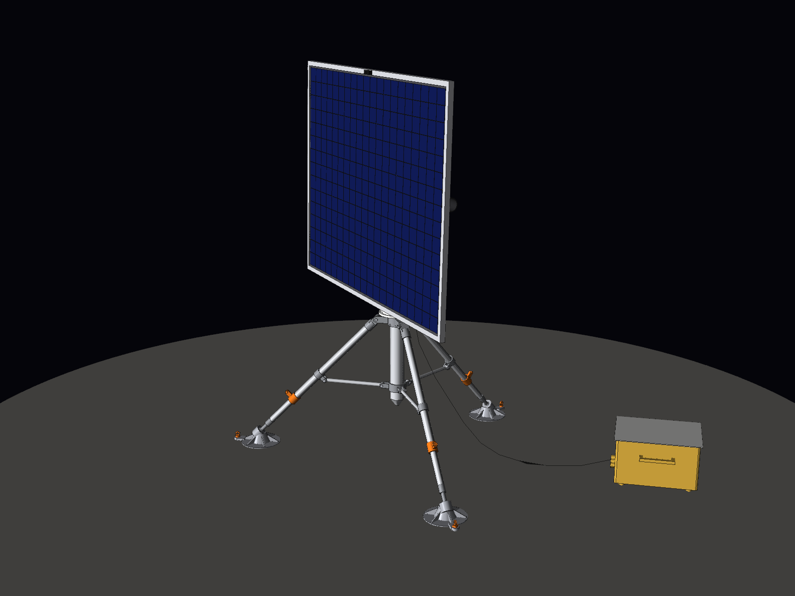
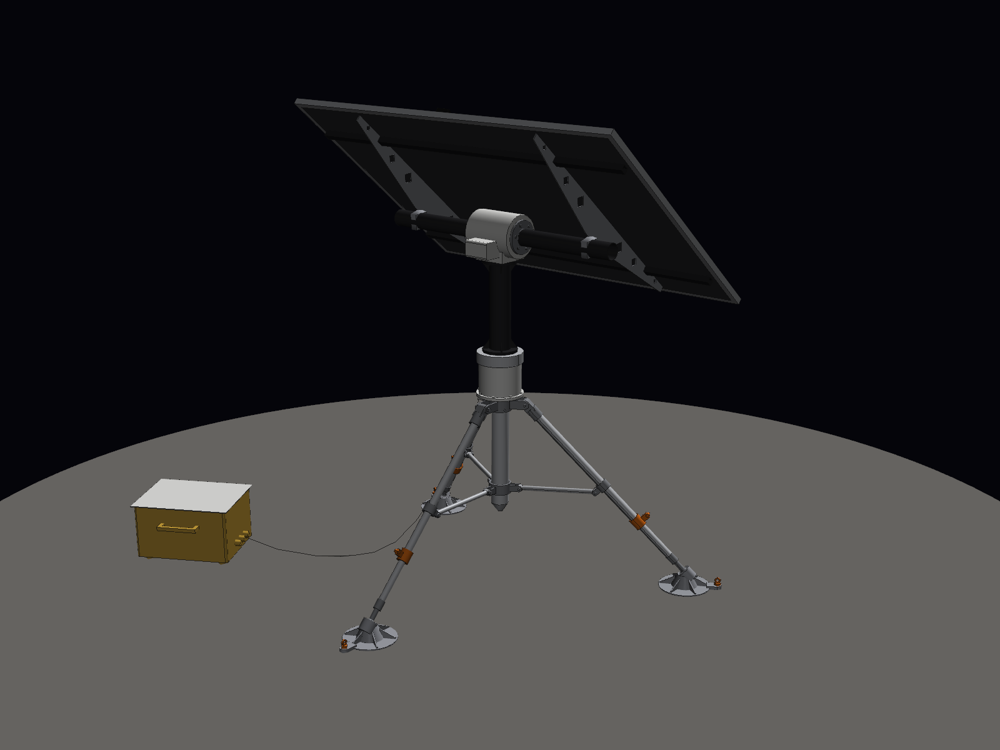

# Tracker solaire lunaire deux axes — maquette 3D à l'échelle 1:1

Maquette CAO complète d'un tracker solaire destiné à la surface de la Lune. Elle reprend
l'architecture des images de référence : trépied déployable, colonne centrale, tête
mécanique deux axes (azimut + élévation), panneau photovoltaïque 1,6 × 1,2 m, faisceau
de câbles et unité de contrôle posée au sol.
Toutes les cotes sont en **millimètres, à taille réelle**.

| Pôle Sud (soleil rasant, panneau quasi vertical) | Latitude moyenne (soleil à 50°) |
|---|---|
|  |  |
|  |  |

---

## 1. Fichiers

| Fichier | Contenu |
|---|---|
| `CAO/Tracker_Lunaire_PoleSud.step` | **Assemblage principal** : pose de fonctionnement au pôle Sud (site Artemis), soleil à +1,5° |
| `CAO/Tracker_Lunaire_LatitudeMoyenne.step` | Même assemblage, pose « sites Apollo » : soleil à 50°, panneau incliné à 40° (comme sur les images) |
| `CAO/pieces/*.step` | Les 29 pièces seules, chacune dans son repère de construction |
| `docs/bilan_masse.csv` | Bilan de masse pièce par pièce (séparateur `;`, s'ouvre dans Excel) |
| `docs/apercu_*.png` | Rendus (iso, face, profil, arrière, détails tête et pied) |
| `generate_tracker.py` | Script paramétrique qui génère toute la CAO, le bilan de masse et les contrôles |
| `render_apercu.py` | Génère les rendus PNG |

### Ouvrir dans SolidWorks

Un fichier SolidWorks natif (`.SLDASM` / `.SLDPRT`) ne peut être écrit que par SolidWorks
lui-même. Le format STEP AP214 fourni s'ouvre directement comme un assemblage complet,
avec les noms des pièces, les sous-assemblages et les couleurs.

1. **Fichier › Ouvrir**, type *STEP AP203/214/242 (\*.step; \*.stp)*, puis choisir
   `CAO/Tracker_Lunaire_PoleSud.step`.
2. Si SolidWorks demande un modèle de document, prendre l'assemblage et la pièce **en mm**.
3. **Fichier › Enregistrer sous › Assemblage (\*.sldasm)**. Au premier enregistrement,
   SolidWorks crée les fichiers `.SLDPRT` de chaque pièce (`Patin.SLDPRT`, `Cadre_Panneau.SLDPRT`, …).
   Pour tout regrouper dans un dossier, utiliser **Fichier › Pack and Go**.

Repère : **Y vertical** (le plan de dessus de SolidWorks correspond au sol).
L'origine est au sol, sur l'axe d'azimut, et l'axe d'élévation est horizontal à Y = 1500 mm.
Les pièces arrivent fixes, sans contraintes. Pour animer le tracker, libérer
`SA_Tete_Orientable` et ajouter une contrainte coaxiale entre `Plateau_Azimut` et
`Carter_Actionneur_Azimut`. Faire de même pour `SA_Panneau` avec l'axe du `Carter_Actionneur_Elevation`.

Arborescence :

```
Tracker_Lunaire_PoleSud
├── SA_Trepied            colonne, colliers, 3 × Jambe_n, 3 × entretoises, 3 × patins, 3 × piquets
├── SA_Azimut_Fixe        actionneur d'azimut (fixe)
├── SA_Tete_Orientable    plateau tournant, mât, actionneur d'élévation      ← tourne en azimut
│   └── SA_Panneau        flasques, tube de torsion, nervures, lisses,
│                         substrat, cadre, cellules PV, capteur solaire      ← tourne en élévation
├── SA_Unite_Sol          unité de contrôle / batteries + radiateur
└── SA_Faisceau           faisceau de câbles
```

---

## 2. Conditions lunaires et réponses de conception

| Contrainte lunaire | Conséquence sur le tracker |
|---|---|
| **Gravité 1,62 m/s² (1/6 g)**, **pas d'atmosphère donc pas de vent** | Le vent dimensionne les trackers terrestres ; ici il n'existe pas. La structure est donc fine et légère : tubes Ø40 × 1,5, mât Ø90 en carbone. Elle reste dimensionnée pour supporter son poids **sur Terre à 1 g** (essais) et pour le lancement en configuration repliée. |
| **Températures de −173 °C (nuit) à +127 °C (jour)** | Matériaux choisis pour leur tenue au cyclage : Ti-6Al-4V, Al 7075-T73, carbone M55J/cyanate. Les carters des actionneurs sont peints en blanc (faible α/ε), l'unité au sol est sous MLI dorée avec un radiateur zénithal blanc. Il n'y a **aucune ailette**, car sans air il n'y a pas de convection. Les roulements ont un jeu prévu pour le cyclage thermique. |
| **Vide poussé** | Risque de soudage à froid et de dégazage. Les contacts glissants sont en matériaux différents : colliers en titane sur colonne aluminium anodisée dur. Les axes en titane reçoivent un revêtement MoS₂ et les réducteurs une lubrification sèche MoS₂ ou Braycote 601EF. Les matériaux sont à faible dégazage (ASTM E595). Aucun volume n'est fermé : le piédestal creux des patins est percé d'un évent. |
| **Régolithe** : poussière fine, anguleuse, abrasive, chargée électrostatiquement | Jupe **labyrinthe** anti-poussière sur le palier d'azimut (jeu de 3 mm). Connecteurs orientés vers le bas. Câbles passés à l'intérieur de l'arbre creux et du mât. Revêtement électrodynamique anti-poussière (EDS) possible sur le verre des cellules. Le panneau se met en position de garde, par la tranche, lors des atterrissages voisins (projections du souffle). |
| **Sol meuble et irrégulier** : densité ~1,5 g/cm³ en surface, plus compact sous 30 cm | **Trépied**, car trois appuis restent toujours en contact sur un sol irrégulier. **Patins Ø220 à crampons** montés sur rotule (débattement ±20°). **Jambes télescopiques** avec bagues de blocage pour la mise à niveau. **Piquets d'ancrage** en titane de 450 mm, qui atteignent la couche compacte. |
| **Rayonnement UV et particules** | Cellules triple jonction GaInP/GaAs/Ge durcies, avec verre de protection dopé au cérium. Isolants de câbles en PTFE ou polyimide, sans PVC. |
| **Jour lunaire de 29,5 jours terrestres** | Le Soleil se déplace d'environ **0,5°/h**. Le suivi est donc très lent : réducteurs harmoniques à fort rapport, faible consommation, pointage en boucle ouverte sur éphémérides puis corrigé par un **capteur solaire fin** placé sur le bord du cadre. |

## 3. Choix de l'angle et de la forme du panneau

Sur la Lune, l'axe de rotation n'est incliné que de **1,54°**. La hauteur du Soleil à midi
vaut donc presque exactement 90° moins la latitude du site, et l'angle du panneau
dépend d'abord du lieu :

* **Pôle Sud (site de référence, programme Artemis)** : le Soleil reste à **±1,5° de
  l'horizon** et fait **un tour complet d'azimut par jour lunaire**. Le panneau doit être
  **quasi vertical** (88,5° par rapport au sol) et tourner **en continu sur 360°**. L'azimut
  utilise donc un collecteur tournant (slip ring de type SADM satellite) logé dans l'arbre
  creux. C'est la pose du fichier principal. Les sommets de cratère de cette région sont
  éclairés 80 à 90 % du temps : c'est là qu'un tracker produit le plus.
* **Latitudes moyennes (sites Apollo, environ 20 à 26°N)** : le Soleil monte jusqu'à 64–70°.
  La pose fournie (Soleil à 50°) donne un panneau **incliné à 40°**, comme sur les images.
* Au lever et au coucher du Soleil, **tout site** exige un panneau vertical. La plage
  d'élévation couvre donc **−2° à +92°** (butées mécaniques), et le même tracker
  fonctionne à n'importe quelle latitude.

Géométrie retenue :

* Panneau **1600 × 1200 mm en format paysage**, avec l'axe d'élévation parallèle au grand côté.
  En position verticale, le bord bas ne descend ainsi que de 600 mm sous l'axe, au lieu de
  800 mm. On gagne 200 mm de hauteur de trépied et le centre de gravité est plus bas.
* **Axe d'élévation à 1500 mm du sol.** C'est la hauteur minimale pour que le panneau
  vertical (bord bas à environ 900 mm) passe au-dessus du moyeu des jambes, avec au moins
  29 mm de garde sur toute la plage. Elle limite aussi l'ombre du relief au pôle et reste à
  hauteur de main d'un astronaute en scaphandre.
* Face arrière du panneau à **146 mm de l'axe**, pour laisser la place à la tête. Le
  déséquilibre qui en résulte n'est que de ≈ 2,3 N·m sur la Lune (14 N·m lors des essais
  sur Terre), sans contrepoids.

## 4. Trépied

* Articulations des jambes à **780 mm** du sol, sous la zone balayée par le panneau.
* **Écartement de 44°** par rapport à la verticale. Les pieds sont sur un cercle de
  **Ø1600 mm**, soit Ø1820 mm hors patins (≈ Ø1920 mm avec les pattes des piquets).
* **Stabilité sans ancrage** : le centre de gravité du tracker est à 0,98–1,0 m de haut.
  Le tracker ne bascule qu'au-delà d'une pente de **20,5°**. Le basculement dépend
  uniquement de la géométrie, pas de la gravité. En revanche, en 1/6 g, le couple de
  rappel est six fois plus faible face à un choc (astronaute, rover). Les 3 piquets
  d'ancrage apportent cette marge.
* **Pression sous patin** : 540 Pa sur la Lune, bien en dessous de la capacité portante
  du régolithe de surface.
* Entretoises reliant les jambes à un collier inférieur coulissant. Pour le transport,
  les jambes se replient contre la colonne.

## 5. Matériaux

| Élément | Matériau |
|---|---|
| Ferrures, colliers, axes, bagues, piquets | Ti-6Al-4V (axes revêtus MoS₂) |
| Tubes de jambes, colonne, entretoises, nervures, patins | Al 7075-T73 anodisé dur |
| Mât tournant, tube de torsion, lisses, cadre du panneau | Composite carbone M55J / cyanate-ester (CTE ≈ 0) |
| Substrat du panneau | Nid d'abeille aluminium 20 mm, peaux carbone |
| Cellules | Triple jonction GaInP/GaAs/Ge (≈ 30 %) + verre CMG 100 µm |
| Carters d'actionneurs | Al 6061-T6 peint en blanc. Moteur sans balais, réducteur harmonique, roulements hybrides (billes Si₃N₄), codeur absolu |

## 6. Caractéristiques principales

| Grandeur | Valeur |
|---|---|
| Hauteur de l'axe d'élévation | 1500 mm |
| Hauteur hors tout (panneau vertical, pôle Sud) | 2104 mm |
| Hauteur hors tout (panneau à 40°) | 2030 mm |
| Panneau | 1600 × 1200 × 26 mm, 300 modules de cellules |
| Surface active | 1,64 m² |
| Puissance crête estimée | ≈ 670 W en début de vie (AM0, 1361 W/m², 30 %), ≈ 600–650 W à température de fonctionnement |
| Débattement d'azimut | 360° continu (collecteur tournant) |
| Débattement d'élévation | −2° à +92° (butées mécaniques) |
| Vitesse de suivi | ≈ 0,5°/h (Soleil), ralliement ≈ 1°/s |

### Bilan de masse (calculé sur la CAO)

| Sous-ensemble | Masse |
|---|---|
| Panneau (substrat, cellules, cadre, nervures, tube de torsion…) | 12,3 kg |
| Tête orientable (plateau, mât, actionneur d'élévation) | 7,2 kg |
| Actionneur d'azimut | 5,5 kg |
| Trépied complet (jambes, patins, piquets, entretoises…) | 13,1 kg |
| **Tracker** | **38,0 kg** (poids lunaire 62 N) |
| Unité de contrôle au sol (batteries, électronique, radiateur) | 18,2 kg |
| Faisceau de câbles | 0,9 kg |
| **Total livré** | **57,1 kg** |

Le détail pièce par pièce est dans `docs/bilan_masse.csv`. Le substrat et les cellules
sont calculés avec une densité équivalente (≈ 2,1 kg/m² et ≈ 1,1 kg/m²). Les actionneurs
et l'unité au sol ont une **masse forfaitaire** (5,5 kg, 4,8 kg et 17 kg), car leur
intérieur n'est pas modélisé.

## 7. Vérifications effectuées par le script

* **Interférences pièce à pièce** dans les deux poses : aucune.
* **Garde sur toute la plage de mouvement** (élévation de −2° à +92°, azimut sur 360°,
  avec la symétrie à 120° du trépied) :
  * panneau (cadre, nervures, lisses) face à toute autre structure : **29 mm minimum**,
    atteints en butée basse à −2° ;
  * mât et carter d'élévation face à la partie fixe : 15 mm ;
  * jeux fonctionnels : 2 mm entre les flasques et le carter d'élévation, 3 mm pour la
    jupe labyrinthe.
* **Relecture** des fichiers STEP produits : 366 solides, géométrie valide.

## 8. Limites

Il s'agit d'une maquette de conception préliminaire, pas d'un matériel qualifié pour le vol.
L'intérieur des actionneurs, les verrous de lancement, le collecteur tournant, la
visserie de détail et l'électronique ne sont pas modélisés, mais leur encombrement et
leur masse sont réservés. Le dimensionnement mécanique (lancement, modes propres,
thermique) reste à faire.

## 9. Régénérer ou modifier la CAO

Tous les paramètres (dimensions du panneau, hauteur d'axe, écartement du trépied,
poses…) sont regroupés en tête de `generate_tracker.py`, dans le dictionnaire `P` et
dans `POSES`.

```bash
pip install -r requirements.txt
python generate_tracker.py              # STEP + bilan de masse + contrôle d'interférences
python generate_tracker.py --balayage   # + garde sur toute la plage az/él (~10 min)
xvfb-run -a python render_apercu.py     # rendus PNG (xvfb-run seulement sans écran)
```
