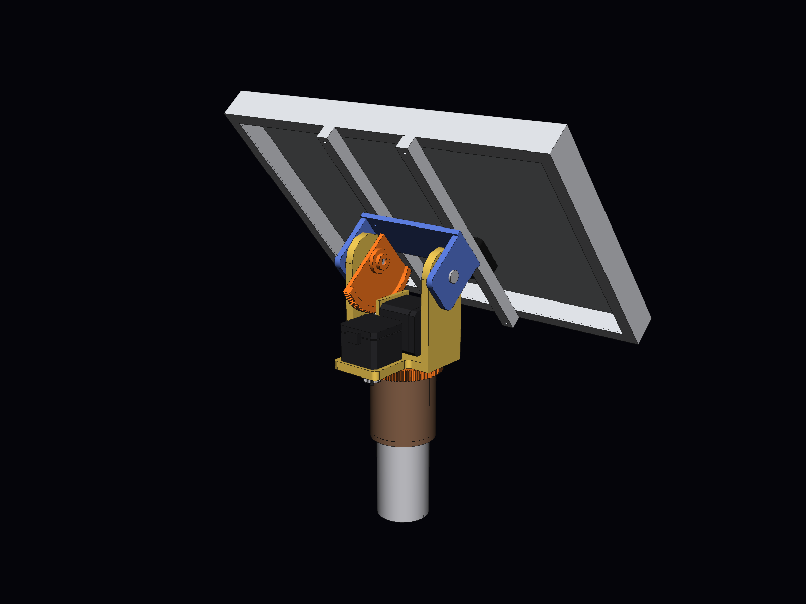
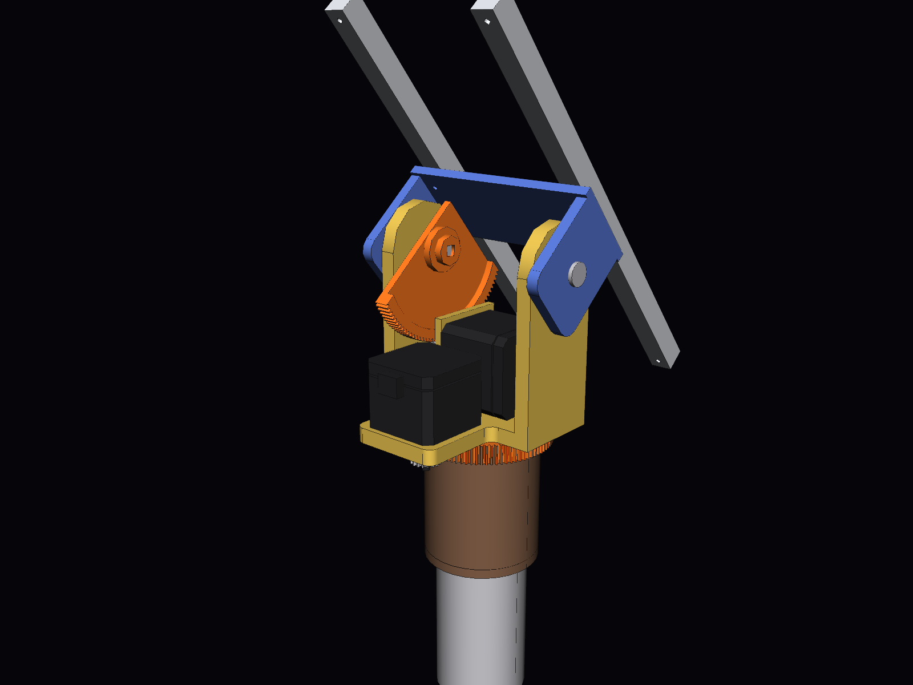
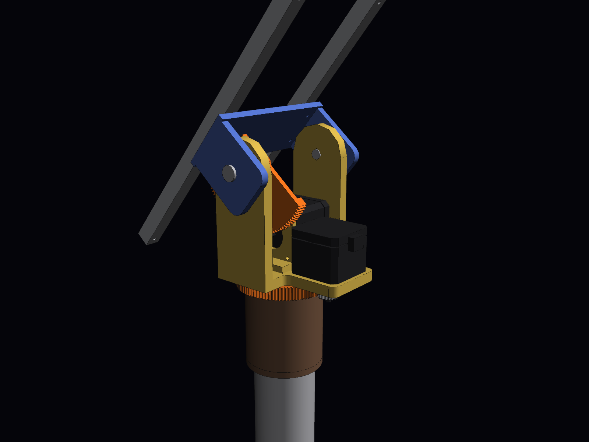
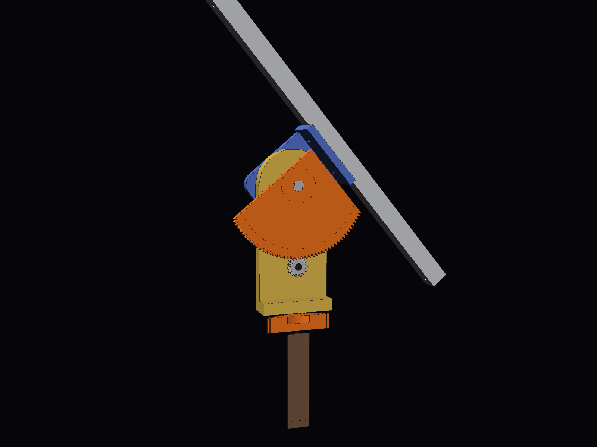
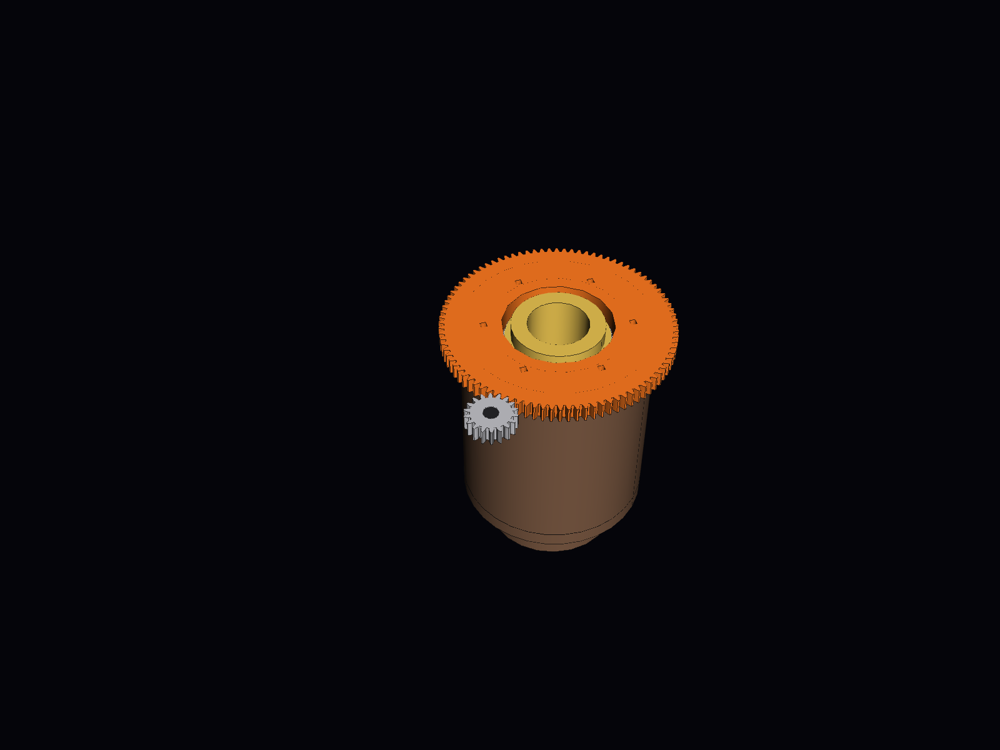

# Tracker solaire lunaire deux axes — maquette 3D à l'échelle 1:1

Maquette CAO d'un tracker solaire destiné à la surface de la Lune. Elle comprend un
trépied déployable, une **tête mécanique centrale à engrenages** (azimut + élévation,
deux moteurs pas à pas), **le panneau photovoltaïque de 356 × 253 × 30 mm**, un faisceau
de câbles et une unité de contrôle posée au sol.
Toutes les cotes sont en **millimètres, à taille réelle**.

| Vue d'ensemble (panneau à 40°) | Tête mécanique, côté engrenages |
|---|---|
|  |  |
|  |  |

---

## 1. Fichiers

| Fichier | Contenu |
|---|---|
| `CAO/Tracker_Lunaire_PoleSud.step` | **Assemblage principal** : pose de fonctionnement au pôle Sud (site Artemis), Soleil à +1,5°, panneau quasi vertical |
| `CAO/Tracker_Lunaire_LatitudeMoyenne.step` | Même assemblage, pose « sites Apollo » : Soleil à 50°, panneau incliné à 40° |
| `CAO/pieces/*.step` | Les 34 pièces seules, chacune dans son repère de construction |
| `docs/bilan_masse.csv` | Bilan de masse pièce par pièce (séparateur `;`, s'ouvre dans Excel) |
| `docs/apercu_*.png` | Rendus (iso, face, profil, arrière, détails de la tête et du pied) |
| `docs/optimisation_angle_jambes.md` | Optimisation de l'angle φ des jambes : exigences, résultats angle par angle, sensibilité |
| `generate_tracker.py` | Script paramétrique qui génère toute la CAO, le bilan de masse et les contrôles |
| `optimisation_angle.py` | Calcule l'angle φ optimal des jambes à partir des masses de la CAO |
| `render_apercu.py` | Génère les rendus PNG |
| `CAO/Tete_Rotative_VisSansFin.step` | **Étude à part** : tête rotative motorisée, **version vis sans fin**, avec le panneau monté à 40° (voir § 12) |
| `CAO/Tete_Rotative_Engrenages.step` | La même tête, **version engrenages droits** (pignon et roue), avec le panneau à 40° |
| `CAO/pieces_tete_vissansfin/*.step`, `CAO/pieces_tete_engrenages/*.step` | Les pièces de chaque version, seules |
| `generate_tete_motorisee.py`, `render_tete_motorisee.py` | Génération des deux têtes (CAO, calcul des couples, contrôles) et de leurs rendus |

### Ouvrir dans SolidWorks

Un fichier SolidWorks natif (`.SLDASM` / `.SLDPRT`) ne peut être écrit que par SolidWorks
lui-même. Le format STEP AP214 fourni s'ouvre directement comme un assemblage complet,
avec les noms des pièces, les sous-assemblages et les couleurs.

1. **Fichier › Ouvrir**, type *STEP AP203/214/242 (\*.step; \*.stp)*, puis choisir
   `CAO/Tracker_Lunaire_PoleSud.step`.
2. Si SolidWorks demande un modèle de document, prendre l'assemblage et la pièce **en mm**.
3. **Fichier › Enregistrer sous › Assemblage (\*.sldasm)**. Au premier enregistrement,
   SolidWorks crée les fichiers `.SLDPRT` de chaque pièce.
   Pour tout regrouper dans un dossier, utiliser **Fichier › Pack and Go**.

Repère : **Y vertical**, c'est-à-dire que le plan de dessus de SolidWorks correspond au sol.
* L'origine est au sol, sur l'axe d'azimut (**axe Y**).
* L'axe d'élévation est horizontal (**axe X** dans la pose de référence), à Y = 700 mm.
* Les pièces arrivent fixes, sans contraintes. Pour animer le tracker :
  * libérer `SA_Tete_Orientable` et ajouter une contrainte coaxiale entre `Couronne_Azimut` et `Roulement_Azimut` ;
  * libérer `SA_Panneau` et ajouter une contrainte coaxiale entre `Arbre_Elevation` et les alésages de l'`Etrier_Tete` ;
  * ajouter des contraintes d'engrenage entre `Couronne_Azimut` et `Pignon_Azimut` (rapport 120:18), puis entre `Roue_Elevation` et `Pignon_Elevation` (72:24).

Arborescence :

```
Tracker_Lunaire_PoleSud
├── SA_Trepied            colonne, colliers, 3 × Jambe_n, 3 × entretoises, 3 × patins, 3 × vis d'ancrage
├── SA_Tete_Fixe          embase (bleue), roulement d'azimut, moteur pas à pas + pignon d'azimut
├── SA_Tete_Orientable    couronne (orange), étrier en U, moteur pas à pas + pignon d'élévation   ← tourne en azimut (Y)
│   └── SA_Panneau        axe, roue d'élévation (noire), berceau, 2 rails,
│                         cadre, laminé, cellules, boîte de jonction                             ← tourne en élévation (X)
├── SA_Unite_Sol          unité de contrôle / batteries + radiateur
└── SA_Faisceau           faisceau de câbles
```

---

## 2. Tête mécanique centrale

Conçue sur le principe d'une tourelle à engrenages : une grande couronne pour l'azimut,
un étrier en U qui porte l'axe d'élévation, un moteur pas à pas par axe.

| Élément | Choix |
|---|---|
| **Embase** (bleue) | Plaque Al Ø200 × 8 posée sur la colonne du trépied, avec un téton de centrage dans la colonne et une oreille qui porte le moteur d'azimut |
| **Azimut (axe Y)** | Moteur pas à pas **NEMA 17**, arbre vertical, fixé **sous** l'embase entre deux jambes. Son pignon Z18 (module 1,5) entraîne la **couronne Z120** (orange, Ø183), qui tourne sur un roulement à section mince Ø90/Ø50. Rapport **6,67** |
| **Étrier** (gris) | U en aluminium : semelle vissée sur la couronne, deux bras de 8 mm à sommet chanfreiné, paliers de l'axe d'élévation à 700 mm du sol |
| **Élévation (axe X)** | Moteur pas à pas **NEMA 17** logé **dans** l'étrier, arbre horizontal traversant le bras droit. Son pignon Z24 (gris, module 1) entraîne la **roue Z72** (noire) calée sur l'axe Ø12. Rapport **3** |
| **Liaison au panneau** | Berceau calé sur l'axe (moyeu + deux flasques + plaque 200 × 60), puis **deux rails 20 × 5** vissés sur l'aile arrière du cadre du panneau |
| **Passage des câbles** | Trou central Ø40 dans l'embase, le roulement et la couronne : les câbles du moteur d'élévation descendent par l'axe d'azimut |

Résolution : moteur de 200 pas/tour (1,8°). Le Soleil se déplace d'environ 0,5°/h.

| Axe | Rotation par pas entier | En micro-pas 1/16 |
|---|---|---|
| Azimut | 0,27° | 0,017° |
| Élévation | 0,6° | 0,04° |

C'est largement assez fin pour un suivi à mieux que 0,5°.

**Plages de mouvement** :
* azimut sur 360°, en continu avec un collecteur tournant dans le passage central, ou limité à ±270° sans collecteur ;
* élévation de −2° à +92° (butées). Le panneau peut ainsi passer à la verticale au lever et au coucher du Soleil, et en permanence au pôle Sud.

Les couleurs reprennent celles du prototype (couronne orange, étrier gris, roue noire).
Pour la Lune, les matières sont adaptées (voir § 4).

## 3. Panneau photovoltaïque

* **356 × 253 × 30 mm** : cadre aluminium en C (rebord avant et aile arrière de 12 mm),
  laminé verre 3,2 mm + EVA + face arrière, 72 cellules (9 × 8), boîte de jonction au dos.
* Monté en **format paysage** : l'axe d'élévation est parallèle au côté de 356 mm.
* Le dos du cadre est à **60 mm de l'axe d'élévation**. Ce décalage permet au panneau de
  passer à la verticale en restant devant les bras de l'étrier. Son point le plus bas
  (≈ 571 mm du sol, à −2°) reste alors 21 mm au-dessus de la couronne d'azimut (550 mm).
* Les coins en plastique noir visibles sur la photo du panneau sont des protections
  d'emballage. Ils ne sont pas modélisés.

## 4. Conditions lunaires et réponses de conception

| Contrainte lunaire | Conséquence sur le tracker |
|---|---|
| **Gravité 1,62 m/s² (1/6 g)**, **pas de vent** | Charges très faibles sur la tête et le trépied. Le couple dû au déséquilibre du panneau autour de l'axe d'élévation est six fois plus faible que sur Terre. Les essais au sol à 1 g restent le cas le plus exigeant pour les moteurs. |
| **Vide** | **Soudage à froid** : chaque engrènement associe deux matériaux différents (couronne et roue en Al 7075 anodisé dur + MoS₂, pignons en inox 17-4PH), avec des roulements en acier 440C lubrifiés à sec. **Pas de convection** : un moteur pas à pas maintenu sous courant chauffe. Il faut réduire le courant de maintien et évacuer la chaleur par conduction vers l'étrier. Il faut aussi des moteurs en version « vide » (graisses et isolants à faible dégazage). |
| **Températures de −173 °C à +127 °C** | Jeu de denture de 0,06 module par dent, et jeu radial de 0,1 mm dans les paliers de l'axe, pour absorber les dilatations. Pas de plastique ordinaire dans la tête : le PLA d'un prototype imprimé en 3D se ramollit vers 60 °C. |
| **Régolithe abrasif et électrostatique** | Engrenages exposés à protéger par un capot souple (soufflet), connecteurs orientés vers le bas, câbles passés par l'axe d'azimut. |
| **Sol meuble et irrégulier** | Trépied à trois appuis, patins Ø120 à crampons sur rotule, jambes télescopiques, vis d'ancrage hélicoïdales (voir § 6). |
| **Jour lunaire de 29,5 jours terrestres** | Suivi très lent (≈ 0,5°/h), donc peu de pas moteur et peu d'énergie. |

## 5. Choix de l'angle

Sur la Lune, l'axe de rotation n'est incliné que de **1,54°**. La hauteur du Soleil à midi
vaut donc presque exactement 90° moins la latitude du site :

* **Pôle Sud (programme Artemis)** : le Soleil reste à **±1,5° de l'horizon** et fait
  **un tour complet d'azimut par jour lunaire**. Le panneau est **quasi vertical** et
  l'azimut tourne en continu. C'est la pose du fichier principal.
* **Latitudes moyennes (sites Apollo, environ 20 à 26°N)** : le Soleil monte jusqu'à 64–70°.
  La pose fournie (Soleil à 50°) donne un panneau **incliné à 40°**.
* Au lever et au coucher du Soleil, **tout site** exige un panneau vertical, d'où la plage
  d'élévation de −2° à +92°.

## 6. Trépied

Le trépied a été **redimensionné pour le panneau de 356 × 253 mm et la tête à
engrenages**. L'architecture ne change pas : trois jambes en Y à 120°, articulées sur un
moyeu, avec entretoises vers un collier inférieur coulissant, jambes télescopiques,
patins sur rotule et ancrages.

### Angle φ des jambes : optimisé, **φ = 37°** (angle entre jambe et colonne)

L'articulation haute est fixée par le panneau : tout le trépied doit rester sous le volume
qu'il balaie, à 480 mm du sol. φ fixe alors le rayon des pieds, la longueur des jambes et
leur course télescopique. `optimisation_angle.py` évalue chaque angle de 25° à 60°
avec les masses et le centre de gravité réels de la CAO, dans la pire orientation du panneau.

| Contrainte | Exigence | Effet de φ |
|---|---|---|
| **C1 Stabilité sans ancrage** | Tenir sur une pente de 15°, avec un caillou ou un enfoncement de 50 mm sous un pied, et 5° de marge | Plus φ est grand, plus les pieds sont écartés et plus le tracker est stable : **φ ≥ 37°** |
| **C2 Mise à niveau** | Les jambes télescopiques (deux tubes) remettent la tête de niveau sur une pente de 10° | Plus φ est grand, plus la course nécessaire croît vite : φ ≤ 50,5° |
| **C3 Garde au sol** | Pointe de la colonne à au moins 150 mm du sol | φ ≤ 46° |

Tous les autres critères se dégradent quand φ augmente : longueur et masse des jambes,
poussée reprise par les entretoises (le frottement au sol est six fois plus faible sur la
Lune), course de nivelage et emprise au sol. **L'optimum est donc le plus petit angle
admissible, 37°** (plage admissible : 37° à 46°). La rigidité latérale, maximale à 54,7°,
ne dimensionne pas sur la Lune, où il n'y a pas de vent. L'ancien angle de 43° était
admissible, mais pas optimal.

L'optimum dépend des exigences. Par exemple, il passe à 42,5° pour une pente de 20° ou une marge de 10°. Le détail est dans
[`docs/optimisation_angle_jambes.md`](docs/optimisation_angle_jambes.md). Si la masse
de la tête ou du panneau change, relancer `python optimisation_angle.py`.

### Dimensions qui en découlent

| Dimension | Ce qui l'a fixée |
|---|---|
| **Axe d'élévation à 700 mm** | Le point bas du panneau vertical doit rester nettement au-dessus du sol : il est à 571 mm. Plus haut, le tracker serait plus lourd et moins stable sans raison. |
| **Moyeu des jambes à 480 mm**, juste sous la tête | Tout le trépied reste sous le volume balayé par le panneau. Le moteur d'azimut pend sous l'embase, entre deux jambes. |
| **Pieds sur un cercle de Ø803 mm**, jambes de 551 mm | Conséquence de φ = 37°. Basculement sans ancrage à 25,0° dans la pire orientation du panneau (exigé : 24,7°). |
| **Course télescopique ±89 mm**, bague de blocage | Remise à niveau sur une pente de 10°. Le tube inférieur Ø20 coulisse dans le tube supérieur Ø25 avec au moins 45 mm de recouvrement. |
| **Entretoises horizontales** Ø12 × 1, bride juste au-dessus de la bague | Meilleur bras de levier. Le collier inférieur se place à leur hauteur (266 mm). |
| **Tubes Ø25 × 1,5 et Ø20 × 1,5, colonne Ø50 × 2, axes Ø6 et Ø5** | Minimum pratique à cette échelle (manutention avec des gants de scaphandre, chocs). Ces sections ne sont pas calculées d'après le poids : à vérifier quand la masse sera figée. |
| **Patins Ø120 à crampons, rotule ±20°** | Pression sur le régolithe d'environ 450 Pa sur la Lune ; adaptation aux pentes et aux cailloux. |
| **Vis d'ancrage hélicoïdales Ø60, enfoncées de 400 mm** | Un piquet lisse tient par frottement, six fois plus faible que sur Terre. L'hélice s'appuie au contraire sur la couche compacte du régolithe, sous 30 cm. Les vis se posent avec une visseuse à travers l'anneau du patin. |

Le trépied pèse 4,4 kg (13,1 kg pour la première version, conçue pour le panneau de 1,6 × 1,2 m).

## 7. Matériaux

| Élément | Matériau |
|---|---|
| Embase, étrier, berceau, rails | Al 6061-T6 anodisé |
| Couronne d'azimut, roue d'élévation | Al 7075-T73 anodisé dur + MoS₂ |
| Pignons | Inox 17-4PH |
| Axe d'élévation, ferrures et colliers du trépied, axes, vis d'ancrage | Ti-6Al-4V |
| Roulements | Acier 440C, lubrification sèche |
| Tubes de jambes, colonne, entretoises, patins | Al 7075-T73 anodisé dur |
| Cadre du panneau | Al 6063-T5 |

## 8. Caractéristiques principales

| Grandeur | Valeur |
|---|---|
| Hauteur de l'axe d'élévation | 700 mm |
| Angle des jambes | φ = 37° par rapport à la colonne (optimisé) |
| Emprise au sol | Pieds sur Ø803 mm, Ø923 mm hors patins (≈ Ø1100 mm avec les anneaux d'ancrage) |
| Panneau | 356 × 253 × 30 mm, 72 cellules |
| Puissance du panneau | ≈ 10 W crête sur Terre (valeur typique de ce format, à confirmer sur sa fiche) |
| Débattements | Azimut 360°, élévation −2° à +92° |
| Réductions | Azimut 120:18 (6,67), élévation 72:24 (3) |
| Masse de la tête (partie fixe + partie tournante) | 3,4 kg, dont 2 × 0,36 kg de moteurs |
| Masse de la partie qui bascule (panneau + berceau + axe + roue) | 1,7 kg, dont 1,0 kg de panneau |
| Masse du trépied | 4,4 kg |
| Masse du tracker complet | 9,4 kg (poids lunaire ≈ 15 N) |

Le détail pièce par pièce est dans `docs/bilan_masse.csv`. Les moteurs NEMA 17 et l'unité au
sol ont une **masse forfaitaire**, car leur intérieur n'est pas modélisé.

## 9. Vérifications effectuées par le script

* **Interférences pièce à pièce** dans les deux poses : **aucune**. Les engrenages sont
  en prise avec leur jeu de denture, sans chevauchement.
* **Garde sur toute la plage de mouvement** (élévation de −2° à +92°, azimut sur 360°,
  `python generate_tracker.py --balayage`) :
  * partie qui bascule (panneau + berceau) face à tout le reste : 5 mm au plus près,
    c'est le jeu axial prévu entre le moyeu du berceau et le bras de l'étrier ;
    le point bas du panneau passe 21 mm au-dessus de la couronne, en butée à −2° ;
  * denture roue / pignon d'élévation : 0,1 mm (jeu de denture, sans contact) ;
  * étrier et moteur d'élévation face à la partie fixe : 15 mm.
* **Stabilité** : basculement sans ancrage à 25,0° dans la pire orientation du panneau
  (`optimisation_angle.py`).
* **Relecture** des fichiers STEP produits : 131 solides, géométrie valide.

## 10. Limites

* Il s'agit d'une maquette de conception, pas d'un matériel qualifié pour le vol.
* Le panneau de 356 × 253 mm est un panneau terrestre (verre, EVA, boîte de jonction en
  plastique). Sur la Lune, les cycles thermiques et le vide le dégraderaient.
* Les moteurs NEMA 17 standard ne sont pas prévus pour le vide.
* Un train d'engrenages droits n'est pas irréversible : le panneau est tenu par le couple
  de maintien des moteurs. Une vis sans fin rendrait l'élévation irréversible.
* Le dimensionnement mécanique (efforts, lancement, thermique) reste à faire une fois la
  masse définitive connue.

## 11. Régénérer ou modifier la CAO

Tous les paramètres (dimensions du panneau, hauteur d'axe, décalage du panneau, position
des moteurs, angle et exigences du trépied, poses…) sont regroupés en tête de `generate_tracker.py`, dans le
dictionnaire `P`, dans `POSES` et dans les constantes d'engrenages (`Z_COURONNE`,
`Z_PIGNON_AZ`, `M_AZ`, `Z_ROUE_EL`, `Z_PIGNON_EL`, `M_EL`).

```bash
pip install -r requirements.txt
python generate_tracker.py              # STEP + bilan de masse + contrôle d'interférences
python generate_tracker.py --balayage   # + garde sur toute la plage az/él
python optimisation_angle.py            # angle φ optimal des jambes (à reporter dans P["leg_angle"])
xvfb-run -a python render_apercu.py     # rendus PNG (xvfb-run seulement sans écran)
```

## 12. Tête rotative motorisée : version vis sans fin et version engrenages droits (étude à part)

Deux fichiers à part du tracker complet. Les deux versions gardent **la même structure**,
**sans contrepoids** :
* un socle cylindrique Ø62 posé sur la colonne, avec deux roulements 6806 ;
* une chape en U (jaune) qui tourne en azimut ;
* un **chapeau en U renversé** (bleu) qui porte le panneau. Il pivote sur deux axes Ø8,
  montés sur roulements 608 dans les bras de la chape.

Seule la transmission change :

| | **Vis sans fin** : `CAO/Tete_Rotative_VisSansFin.step` | **Engrenages droits** : `CAO/Tete_Rotative_Engrenages.step` |
|---|---|---|
| Moteur d'élévation (axe horizontal) | **NEMA 17 court, 42 × 42 × 34 mm** : 0,28 N·m, 1,3 A, 0,22 kg (type 17HS3401) | **NEMA 17, 42 × 42 × 40 mm** : 0,40–0,42 N·m, 1,5–1,7 A, 0,28 kg (type 17HS4401) |
| Transmission d'élévation | Vis m1 Ø16, un filet + roue bronze Z50 sur le pivot gauche du chapeau : **50:1** | Pignon inox m0,8 Z15 + secteur denté alu m0,8 Z120 sur le pivot gauche : **8:1** |
| Moteur d'azimut (axe vertical) | **NEMA 11, 28 × 28 × 45 mm** : 0,095 N·m, 0,67 A, 0,14 kg (type 11HS18-0674S) | **NEMA 17 court, 42 × 42 × 34 mm** : 0,28 N·m, 1,3 A, 0,22 kg (type 17HS3401) |
| Transmission d'azimut | Vis m0,8 Ø12 + roue bronze Z60 **fixée sur le socle** : **60:1** | Pignon inox m0,8 Z18 + couronne alu Z92 **fixée sur le socle** : **5,1:1** |
| Irréversible (tient sans courant) | **Oui, sur les deux axes** | Non |
| Axe d'élévation au-dessus de la colonne | 156 mm | 164 mm |
| Masse de la tête, hors panneau | 1,76 kg | 1,71 kg |

| Vis sans fin | Engrenages droits |
|---|---|
|  |  |
|  |  |
|  |  |
|  |  |
|  |  |

### Principe commun

* **Azimut** : la roue (ou la couronne) est **fixée sur le socle**. Le moteur est porté par
  la chape, et sa vis (ou son pignon) roule autour de la roue, comme sur une tourelle.
  Les deux moteurs tournent donc avec le panneau. Aucun ne se trouve sur la trajectoire
  du panneau, quel que soit l'azimut.
* **Élévation** : la roue est clavetée sur le pivot gauche du chapeau en U. Le moteur est
  sur la chape, du côté opposé au panneau. Le panneau passe à la verticale (−2°) devant
  la chape, et à l'horizontale (+92°) au-dessus.
* **Vis sans fin** : chaque vis tourne sur son propre arbre Ø5, porté par deux roulements
  685. Un accouplement flexible la relie au moteur, si bien que le moteur ne reçoit pas
  la poussée axiale de la vis.
* **Engrenages** : la roue d'élévation est un **secteur denté** d'environ 130°. Le pignon
  n'engrène que sur le quart avant-bas de la roue, et le reste est supprimé pour passer
  sous la plaque du chapeau. Le moteur d'élévation est couché sous l'axe et le moteur
  d'azimut est vertical sur la queue de la chape, arbre vers le bas.

### Couples : besoins et marges dans tous les cas

Les besoins sont calculés par le script à partir de la CAO :
* partie basculante (chapeau, roue, rails, panneau) : 1,51 kg (vis) / 1,44 kg (engrenages) ;
* centre de gravité à 54–56 mm de l'axe, puisqu'il n'y a pas de contrepoids ;
* couple de gravité maximal (panneau vertical) : 0,79 N·m sur Terre et 0,13 N·m sur la Lune ;
* frottements : 0,01 N·m en élévation et 0,02 N·m en azimut ;
* vent de 10 m/s (36 km/h), sur Terre en extérieur. La pression dynamique vaut 60 Pa, soit
  environ 6,5 N sur le panneau. Le centre de poussée est décalé de 5 à 8 cm en vent oblique,
  ce qui donne **+0,35 N·m en élévation et 0,50 N·m en azimut**.

Le couple disponible est le couple de maintien × 0,7, qui est le couple en marche lente en
micro-pas, puis × rapport × rendement. Rendement d'une vis à un filet avec μ = 0,15 :
0,29 en élévation et 0,30 en azimut. Rendement des engrenages droits : 0,97.

| Marge = disponible / besoin | Lune | Terre, intérieur | Terre, extérieur (vent 10 m/s) |
|---|---|---|---|
| **Vis**, élévation (2,86 N·m dispo.) | ×20 | ×3,5 | **×2,5** |
| **Vis**, azimut (1,22 N·m dispo.) | ×61 | ×41 | **×2,3** |
| **Engrenages**, élévation (2,28 N·m dispo.) | ×16 | ×2,9 | **×2,0** |
| **Engrenages**, azimut (0,97 N·m dispo.) | ×49 | ×32 | **×1,9** |

* **Le cas qui dimensionne est la démonstration sur Terre en extérieur.** C'est pour lui
  qu'on vise une marge d'environ 2, sans surdimensionner. Les grandes marges sur la Lune
  ne sont pas du surdimensionnement : le même matériel doit aussi faire la démonstration
  à 1 g.
* **Chaque moteur est le plus petit moteur courant qui convient.** Un cran en dessous, la
  marge en vent devient insuffisante :
  * vis, élévation : NEMA 11 de 45 mm, ×0,85 ;
  * vis, azimut : NEMA 11 court (32 mm, ≈ 0,05 N·m), ×1,2 ;
  * engrenages, élévation : NEMA 17 de 34 mm, ×1,3 ;
  * engrenages, azimut : NEMA 11 de 45 mm, ×0,6.
* À l'achat, prendre un NEMA 17 de 34 mm annoncé à **0,28 N·m**. Certains vendeurs vendent
  sous la même référence une version à 0,23–0,25 N·m, qui ferait perdre 10 à 20 % de marge.
* Aucun moteur n'est long ni lourd. Le plus long fait 45 mm (le NEMA 11) et le plus lourd
  pèse 0,28 kg.

### Tenue des positions, moteurs à l'arrêt

| | Vis sans fin | Engrenages droits |
|---|---|---|
| Tenue sans courant, sur Terre | **Oui, dans toutes les positions, même dans le vent** : les vis ont un angle d'hélice de 3,6° (élévation) et 3,8° (azimut), inférieur à l'angle de frottement (≈ 5,7°) | **Non** : en élévation, le panneau redescend vers sa butée basse (−2°). Le couple renvoyé au moteur (0,1 N·m) dépasse son couple résiduel (0,022 N·m) |
| Tenue sans courant, sur la Lune | **Oui.** Avec le MoS₂ sous vide, le frottement peut descendre sous le seuil d'irréversibilité. Le couple renvoyé à la vis (≈ 0,0014 N·m) reste alors 11 fois plus faible que le couple résiduel du moteur | Limite : 0,016 N·m renvoyés pour 0,022 N·m de couple résiduel. Il faut garder un faible courant de maintien |
| Courant à l'arrêt | **Aucun** : drivers coupés entre deux mouvements, consommation nulle | Courant de maintien obligatoire. À 50 % du courant nominal, ≈ 3,7 W pour les deux moteurs, soit environ 40 % des ≈ 10 W du panneau. Marge de tenue en vent à 50 % : ×1,4 (élévation) et ×1,3 (azimut). À 100 % : ×2,8 et ×2,7 |
| Coupure d'alimentation | Rien ne bouge | Le panneau tombe sur la butée basse (prévoir une butée caoutchouc), sauf à monter un moteur à frein, plus long d'environ 30 mm |
| Rendement, vitesse | Faible (≈ 30 %) et lent, sans conséquence pour un suivi à 0,5°/h (Lune) ou 15°/h (Terre) | ≈ 97 %, rapide |
| Jeu | Faible, réglable par l'entraxe | Jeu de denture d'environ 0,1 mm, ≈ 0,15° au panneau |

**Recommandation : la version vis sans fin.**
* C'est la seule qui satisfait « tenir dans toutes les positions » **sans consommer** et
  **même en cas de coupure**.
* Sur la Lune, l'énergie est comptée : la nuit lunaire dure 14 jours.

La version engrenages reste valable pour une démonstration en intérieur alimentée sur
secteur, ou si l'on accepte un courant de maintien permanent.

### Résolution et vitesses (moteurs à 200 pas/tour, 1/16 de pas)

| | Vis, élévation | Vis, azimut | Engr., élévation | Engr., azimut |
|---|---|---|---|---|
| Pas entier au panneau | 0,036° | 0,030° | 0,225° | 0,35° |
| Micro-pas (1/16) | 0,0023° | 0,0019° | 0,014° | 0,022° |
| Vitesse conseillée | 14°/s (moteur à 120 tr/min) | 12°/s | 10°/s | 10°/s |

Ces vitesses permettent un retour à plat ou une remise en position en quelques secondes.

### Commande par ESP32

* **Drivers : 2 × TMC2209**, alimentés en logique 3,3 V par l'ESP32. Ils sont silencieux
  et pilotés par UART. Les deux drivers partagent le bus UART, avec les adresses 0 et 1
  fixées par MS1/MS2.
* **Câblage** :
  * élévation : STEP GPIO 25, DIR GPIO 26 ;
  * azimut : STEP GPIO 32, DIR GPIO 33 ;
  * EN commun : GPIO 27 ;
  * UART : TX GPIO 17 vers PDN_UART à travers 1 kΩ, RX GPIO 16 ;
  * fins de course : GPIO 18 et 19, avec pull-up interne.
* **Alimentation : 12 V**, par exemple une batterie LiFePO4 4S de 12,8 V, avec 100 µF au
  plus près de chaque driver. L'ESP32 est alimenté par un abaisseur 12 V → 5 V.
* **Réglages** :
  * courant de marche (`rms_current`) : 1,3 A pour les NEMA 17 de 34 mm, 1,5 A pour le
    NEMA 17 de 40 mm, 0,67 A pour le NEMA 11 ;
  * 16 micro-pas, StealthChop ;
  * courant à l'arrêt (IHOLD) :
    * **vis** : drivers désactivés par EN entre deux mouvements ;
    * **engrenages** : 50 % à l'intérieur ou par vent faible, 100 % au-delà de 5 m/s,
      15 % sur la Lune.
* **Bibliothèques Arduino** : `FastAccelStepper`, qui génère les impulsions STEP en matériel
  sur l'ESP32, avec rampes d'accélération, et `TMCStepper`, pour le courant et le micro-pas
  par UART.
* **Origine** :
  * un micro-switch en butée basse d'élévation (−2°) ;
  * un capteur à effet Hall et un aimant sur la roue fixe pour l'azimut.

  La détection de calage sans capteur (StallGuard) n'est pas fiable à basse vitesse,
  surtout derrière une vis sans fin.
* **Vent fort**, au-delà de 10 m/s, avec un anémomètre ou une prévision : mettre le panneau
  **à plat** (élévation 90°), où le vent a le moins de prise. La vis tient seule ; les
  engrenages ont besoin du courant de maintien à 100 %.
* **Câbles** : ils descendent par le moyeu creux de la chape. La rotation d'azimut est
  limitée à ±180° par la boucle de câble, puis le tracker revient en arrière. Au pôle Sud,
  il faut un tour complet par jour lunaire : on revient en arrière une fois par jour, ou
  l'on monte un collecteur tournant.

### Points propres à la Lune

* Les moteurs NEMA du commerce **ne sont pas prévus pour le vide**. Il faut une version
  « vide » : graisse à faible dégazage, isolation classe H, sans plastique ordinaire.
  Le principe et les tailles restent les mêmes.
* **Pas de convection** : les moteurs ne sont alimentés que pendant les mouvements, ce qui
  est naturel avec la vis. Leur chaleur part par conduction vers la chape en aluminium.
* **Soudage à froid** : chaque contact associe deux matériaux différents.
  * Vis sans fin : vis en inox contre roue en bronze.
  * Engrenages : pignons en inox contre roues en alu 7075 anodisé dur.
  * Roulements en 440C.
  * Lubrification sèche au MoS₂.
* **Régolithe** : poser un soufflet ou un capot sur les dentures et les vis.
* **Températures de −173 à +127 °C** : jeu de denture de 0,1 mm et jeu axial de 2 mm entre
  les flancs du chapeau et les bras de la chape (rondelles PTFE).

### Vérifications faites par le script

* Aucune interférence entre pièces, dans aucune des deux versions.
* Dentures **en prise sans chevauchement** :
  * à −2°, 40° et 92° d'élévation ;
  * à un azimut quelconque (37°), ce qui valide les lois de rotation des vis et des pignons.

  Sur la vis d'azimut, il reste un recouvrement de 0,2 mm³. Il vient de la roue modélisée
  à dents droites, alors qu'une vraie roue de vis sans fin est taillée à la fraise-mère.
* Garde mini de la partie basculante sur toute la course (−2° à 92°) : **2,0 mm**. C'est le
  jeu axial voulu entre les flancs du chapeau et les bras. Le panneau et le secteur denté
  ne touchent rien.

### Dans SolidWorks

* Arborescence :
  * `SA_Socle` : fixe. Fond, socle, roulements 6806 et roue ou couronne fixe d'azimut.
  * `SA_Chape` : tourne en azimut, autour de l'axe Y. Chape, moteurs, vis ou pignons,
    paliers, accouplements, roulements 608.
  * `SA_Basculant` : tourne en élévation, autour de l'axe X. Chapeau en U, pivots, roue
    d'élévation, rails et panneau.
  * `SA_Reference_Trepied` : haut de la colonne, pour le repère.
* L'origine est en haut de la colonne. L'axe d'élévation est à Y = 156 mm (vis) ou
  Y = 164 mm (engrenages).
* Pour animer, libérer `SA_Chape` et `SA_Basculant`, ajouter les contraintes coaxiales,
  puis une contrainte d'engrenage :
  * vis : 1:50 en élévation et 1:60 en azimut ;
  * engrenages : 15:120 et 18:92.

Pour régénérer ou modifier ces têtes :

```bash
python generate_tete_motorisee.py            # les deux versions (ou : VSF / ENG)
xvfb-run -a python render_tete_motorisee.py  # rendus PNG
```

Les moteurs, les rapports et les cas de charge (`VENT_EL`, `VENT_AZ`, `K_RUN`…) sont en tête
du script. Le calcul des marges se met à jour tout seul.

La première étude, avec deux 28BYJ-48 et des contrepoids, a été abandonnée. Elle reste dans
l'historique git, commits `b2470b1` (vis sans fin) et `bcab9e9` (prise directe).
