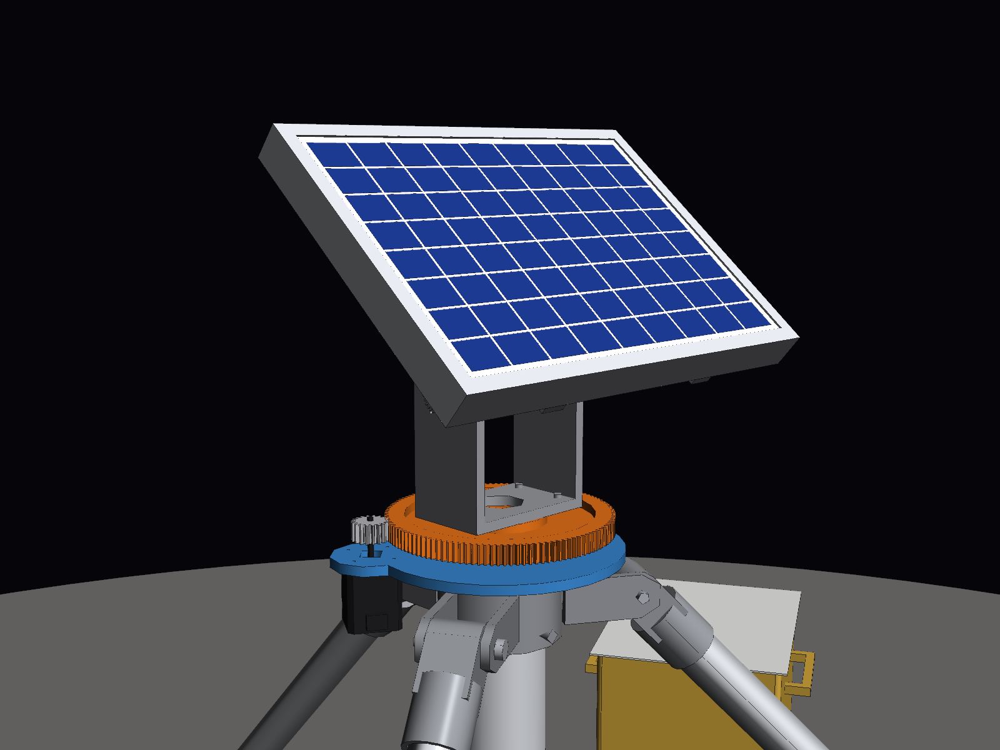

# Tracker solaire lunaire deux axes — maquette 3D à l'échelle 1:1

Maquette CAO d'un tracker solaire destiné à la surface de la Lune. Elle comprend un
trépied déployable, une **tête mécanique centrale à engrenages** (azimut + élévation,
deux moteurs pas à pas), **le panneau photovoltaïque de 356 × 253 × 30 mm**, un faisceau
de câbles et une unité de contrôle posée au sol.
Toutes les cotes sont en **millimètres, à taille réelle**.

| Tête mécanique, côté engrenages | Tête mécanique, face au Soleil |
|---|---|
|  |  |
|  |  |

---

## 1. Fichiers

| Fichier | Contenu |
|---|---|
| `CAO/Tracker_Lunaire_PoleSud.step` | **Assemblage principal** : pose de fonctionnement au pôle Sud (site Artemis), Soleil à +1,5°, panneau quasi vertical |
| `CAO/Tracker_Lunaire_LatitudeMoyenne.step` | Même assemblage, pose « sites Apollo » : Soleil à 50°, panneau incliné à 40° |
| `CAO/pieces/*.step` | Les 34 pièces seules, chacune dans son repère de construction |
| `docs/bilan_masse.csv` | Bilan de masse pièce par pièce (séparateur `;`, s'ouvre dans Excel) |
| `docs/apercu_*.png` | Rendus (iso, face, profil, arrière, détails de la tête et du pied) |
| `generate_tracker.py` | Script paramétrique qui génère toute la CAO, le bilan de masse et les contrôles |
| `render_apercu.py` | Génère les rendus PNG |

### Ouvrir dans SolidWorks

Un fichier SolidWorks natif (`.SLDASM` / `.SLDPRT`) ne peut être écrit que par SolidWorks
lui-même. Le format STEP AP214 fourni s'ouvre directement comme un assemblage complet,
avec les noms des pièces, les sous-assemblages et les couleurs.

1. **Fichier › Ouvrir**, type *STEP AP203/214/242 (\*.step; \*.stp)*, puis choisir
   `CAO/Tracker_Lunaire_PoleSud.step`.
2. Si SolidWorks demande un modèle de document, prendre l'assemblage et la pièce **en mm**.
3. **Fichier › Enregistrer sous › Assemblage (\*.sldasm)**. Au premier enregistrement,
   SolidWorks crée les fichiers `.SLDPRT` de chaque pièce.
   Pour tout regrouper dans un dossier, utiliser **Fichier › Pack and Go**.

Repère : **Y vertical**, c'est-à-dire que le plan de dessus de SolidWorks correspond au sol.
* L'origine est au sol, sur l'axe d'azimut (**axe Y**).
* L'axe d'élévation est horizontal (**axe X** dans la pose de référence), à Y = 1000 mm.
* Les pièces arrivent fixes, sans contraintes. Pour animer le tracker :
  * libérer `SA_Tete_Orientable` et ajouter une contrainte coaxiale entre `Couronne_Azimut` et `Roulement_Azimut` ;
  * libérer `SA_Panneau` et ajouter une contrainte coaxiale entre `Arbre_Elevation` et les alésages de l'`Etrier_Tete` ;
  * ajouter des contraintes d'engrenage entre `Couronne_Azimut` et `Pignon_Azimut` (rapport 120:18), puis entre `Roue_Elevation` et `Pignon_Elevation` (72:24).

Arborescence :

```
Tracker_Lunaire_PoleSud
├── SA_Trepied            colonne, colliers, 3 × Jambe_n, 3 × entretoises, 3 × patins, 3 × piquets
├── SA_Tete_Fixe          embase (bleue), roulement d'azimut, moteur pas à pas + pignon d'azimut
├── SA_Tete_Orientable    couronne (orange), étrier en U, moteur pas à pas + pignon d'élévation   ← tourne en azimut (Y)
│   └── SA_Panneau        axe, roue d'élévation (noire), berceau, 2 rails,
│                         cadre, laminé, cellules, boîte de jonction                             ← tourne en élévation (X)
├── SA_Unite_Sol          unité de contrôle / batteries + radiateur
└── SA_Faisceau           faisceau de câbles
```

---

## 2. Tête mécanique centrale

Conçue sur le principe d'une tourelle à engrenages : une grande couronne pour l'azimut,
un étrier en U qui porte l'axe d'élévation, un moteur pas à pas par axe.

| Élément | Choix |
|---|---|
| **Embase** (bleue) | Plaque Al Ø200 × 8 posée sur la colonne du trépied, avec un téton de centrage dans la colonne et une oreille qui porte le moteur d'azimut |
| **Azimut (axe Y)** | Moteur pas à pas **NEMA 17**, arbre vertical, fixé **sous** l'embase entre deux jambes. Son pignon Z18 (module 1,5) entraîne la **couronne Z120** (orange, Ø183), qui tourne sur un roulement à section mince Ø90/Ø50. Rapport **6,67** |
| **Étrier** (gris) | U en aluminium : semelle vissée sur la couronne, deux bras de 8 mm à sommet chanfreiné, paliers de l'axe d'élévation à 1000 mm du sol |
| **Élévation (axe X)** | Moteur pas à pas **NEMA 17** logé **dans** l'étrier, arbre horizontal traversant le bras droit. Son pignon Z24 (gris, module 1) entraîne la **roue Z72** (noire) calée sur l'axe Ø12. Rapport **3** |
| **Liaison au panneau** | Berceau calé sur l'axe (moyeu + deux flasques + plaque 200 × 60), puis **deux rails 20 × 5** vissés sur l'aile arrière du cadre du panneau |
| **Passage des câbles** | Trou central Ø40 dans l'embase, le roulement et la couronne : les câbles du moteur d'élévation descendent par l'axe d'azimut |

Résolution : moteur de 200 pas/tour (1,8°). Le Soleil se déplace d'environ 0,5°/h.

| Axe | Rotation par pas entier | En micro-pas 1/16 |
|---|---|---|
| Azimut | 0,27° | 0,017° |
| Élévation | 0,6° | 0,04° |

C'est largement assez fin pour un suivi à mieux que 0,5°.

**Plages de mouvement** :
* azimut sur 360°, en continu avec un collecteur tournant dans le passage central, ou limité à ±270° sans collecteur ;
* élévation de −2° à +92° (butées). Le panneau peut ainsi passer à la verticale au lever et au coucher du Soleil, et en permanence au pôle Sud.

Les couleurs reprennent celles du prototype (couronne orange, étrier gris, roue noire).
Pour la Lune, les matières sont adaptées (voir § 4).

## 3. Panneau photovoltaïque

* **356 × 253 × 30 mm** : cadre aluminium en C (rebord avant et aile arrière de 12 mm),
  laminé verre 3,2 mm + EVA + face arrière, 72 cellules (9 × 8), boîte de jonction au dos.
* Monté en **format paysage** : l'axe d'élévation est parallèle au côté de 356 mm.
* Le dos du cadre est à **60 mm de l'axe d'élévation**. Ce décalage permet au panneau de
  passer à la verticale en restant devant les bras de l'étrier. Son point le plus bas
  (≈ 871 mm du sol, à −2°) reste alors au-dessus de la couronne d'azimut (850 mm).
* Les coins en plastique noir visibles sur la photo du panneau sont des protections
  d'emballage. Ils ne sont pas modélisés.

## 4. Conditions lunaires et réponses de conception

| Contrainte lunaire | Conséquence sur le tracker |
|---|---|
| **Gravité 1,62 m/s² (1/6 g)**, **pas de vent** | Charges très faibles sur la tête et le trépied. Le couple dû au déséquilibre du panneau autour de l'axe d'élévation est six fois plus faible que sur Terre. Les essais au sol à 1 g restent le cas le plus exigeant pour les moteurs. |
| **Vide** | **Soudage à froid** : chaque engrènement associe deux matériaux différents (couronne et roue en Al 7075 anodisé dur + MoS₂, pignons en inox 17-4PH), avec des roulements en acier 440C lubrifiés à sec. **Pas de convection** : un moteur pas à pas maintenu sous courant chauffe. Il faut réduire le courant de maintien et évacuer la chaleur par conduction vers l'étrier. Il faut aussi des moteurs en version « vide » (graisses et isolants à faible dégazage). |
| **Températures de −173 °C à +127 °C** | Jeu de denture de 0,06 module par dent, et jeu radial de 0,1 mm dans les paliers de l'axe, pour absorber les dilatations. Pas de plastique ordinaire dans la tête : le PLA d'un prototype imprimé en 3D se ramollit vers 60 °C. |
| **Régolithe abrasif et électrostatique** | Engrenages exposés à protéger par un capot souple (soufflet), connecteurs orientés vers le bas, câbles passés par l'axe d'azimut. |
| **Sol meuble et irrégulier** | Trépied à trois appuis, patins Ø220 à crampons sur rotule, jambes télescopiques, piquets d'ancrage (voir § 6). |
| **Jour lunaire de 29,5 jours terrestres** | Suivi très lent (≈ 0,5°/h), donc peu de pas moteur et peu d'énergie. |

## 5. Choix de l'angle

Sur la Lune, l'axe de rotation n'est incliné que de **1,54°**. La hauteur du Soleil à midi
vaut donc presque exactement 90° moins la latitude du site :

* **Pôle Sud (programme Artemis)** : le Soleil reste à **±1,5° de l'horizon** et fait
  **un tour complet d'azimut par jour lunaire**. Le panneau est **quasi vertical** et
  l'azimut tourne en continu. C'est la pose du fichier principal.
* **Latitudes moyennes (sites Apollo, environ 20 à 26°N)** : le Soleil monte jusqu'à 64–70°.
  La pose fournie (Soleil à 50°) donne un panneau **incliné à 40°**.
* Au lever et au coucher du Soleil, **tout site** exige un panneau vertical, d'où la plage
  d'élévation de −2° à +92°.

## 6. Trépied

Le trépied n'a pas changé : trois jambes articulées à 780 mm du sol, écartées de 44°, pieds sur un
cercle de Ø1600 mm, patins Ø220 à rotule, entretoises vers un collier inférieur, jambes
télescopiques et piquets d'ancrage. Ses dimensions avaient été fixées pour un panneau de
1,6 × 1,2 m. Avec le panneau de 356 × 253 mm, il est plus grand que nécessaire : il
reste stable, mais il pourrait être réduit.

## 7. Matériaux

| Élément | Matériau |
|---|---|
| Embase, étrier, berceau, rails | Al 6061-T6 anodisé |
| Couronne d'azimut, roue d'élévation | Al 7075-T73 anodisé dur + MoS₂ |
| Pignons | Inox 17-4PH |
| Axe d'élévation, ferrures et colliers du trépied, axes, piquets | Ti-6Al-4V |
| Roulements | Acier 440C, lubrification sèche |
| Tubes de jambes, colonne, entretoises, patins | Al 7075-T73 anodisé dur |
| Cadre du panneau | Al 6063-T5 |

## 8. Caractéristiques principales

| Grandeur | Valeur |
|---|---|
| Hauteur de l'axe d'élévation | 1000 mm |
| Panneau | 356 × 253 × 30 mm, 72 cellules |
| Puissance du panneau | ≈ 10 W crête sur Terre (valeur typique de ce format, à confirmer sur sa fiche) |
| Débattements | Azimut 360°, élévation −2° à +92° |
| Réductions | Azimut 120:18 (6,67), élévation 72:24 (3) |
| Masse de la tête (partie fixe + partie tournante) | 3,4 kg, dont 2 × 0,36 kg de moteurs |
| Masse de la partie qui bascule (panneau + berceau + axe + roue) | 1,7 kg, dont 1,0 kg de panneau |
| Masse du tracker complet (avec trépied) | 18,1 kg |

Le détail pièce par pièce est dans `docs/bilan_masse.csv`. Les moteurs NEMA 17 et l'unité au
sol ont une **masse forfaitaire**, car leur intérieur n'est pas modélisé.

## 9. Vérifications effectuées par le script

* **Interférences pièce à pièce** dans les deux poses : **aucune**. Les engrenages sont
  en prise avec leur jeu de denture, sans chevauchement.
* **Garde sur toute la plage de mouvement** (élévation de −2° à +92°, azimut sur 360°) :
  voir la sortie de `python generate_tracker.py --balayage`, reportée ci-dessous.
* **Relecture** des fichiers STEP produits : 140 solides, géométrie valide.

## 10. Limites

* Il s'agit d'une maquette de conception, pas d'un matériel qualifié pour le vol.
* Le panneau de 356 × 253 mm est un panneau terrestre (verre, EVA, boîte de jonction en
  plastique). Sur la Lune, les cycles thermiques et le vide le dégraderaient.
* Les moteurs NEMA 17 standard ne sont pas prévus pour le vide.
* Un train d'engrenages droits n'est pas irréversible : le panneau est tenu par le couple
  de maintien des moteurs. Une vis sans fin rendrait l'élévation irréversible.
* Le dimensionnement mécanique (efforts, lancement, thermique) reste à faire une fois la
  masse définitive connue.

## 11. Régénérer ou modifier la CAO

Tous les paramètres (dimensions du panneau, hauteur d'axe, décalage du panneau, position
des moteurs, trépied, poses…) sont regroupés en tête de `generate_tracker.py`, dans le
dictionnaire `P`, dans `POSES` et dans les constantes d'engrenages (`Z_COURONNE`,
`Z_PIGNON_AZ`, `M_AZ`, `Z_ROUE_EL`, `Z_PIGNON_EL`, `M_EL`).

```bash
pip install -r requirements.txt
python generate_tracker.py              # STEP + bilan de masse + contrôle d'interférences
python generate_tracker.py --balayage   # + garde sur toute la plage az/él
xvfb-run -a python render_apercu.py     # rendus PNG (xvfb-run seulement sans écran)
```
