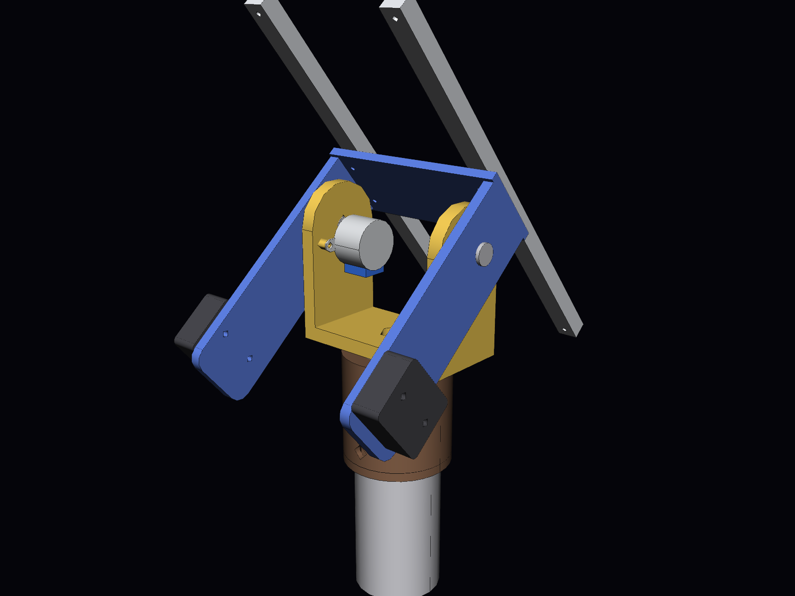
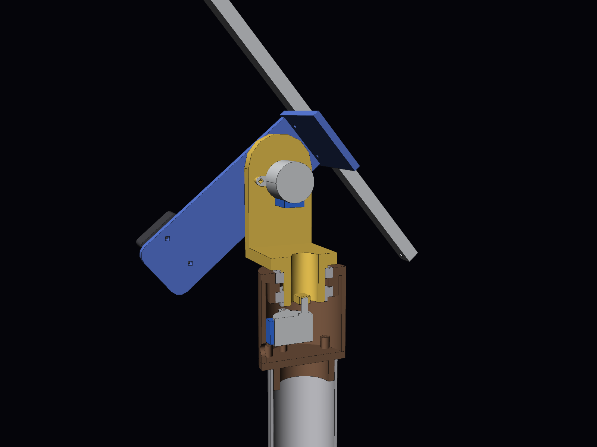
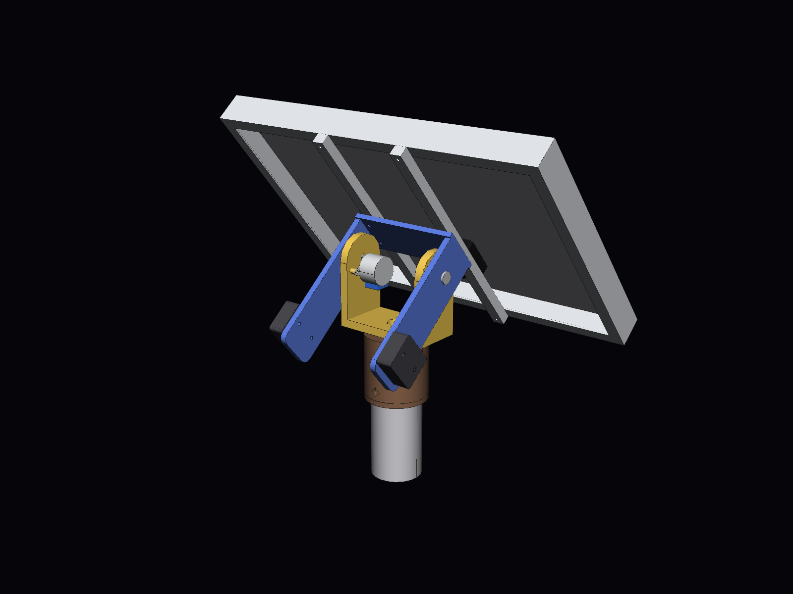
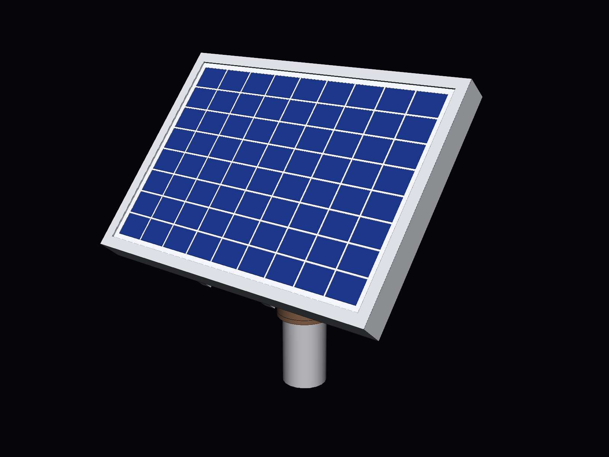

# Tracker solaire lunaire deux axes — maquette 3D à l'échelle 1:1

Maquette CAO d'un tracker solaire destiné à la surface de la Lune. Elle comprend un
trépied déployable, une **tête mécanique centrale à engrenages** (azimut + élévation,
deux moteurs pas à pas), **le panneau photovoltaïque de 356 × 253 × 30 mm**, un faisceau
de câbles et une unité de contrôle posée au sol.
Toutes les cotes sont en **millimètres, à taille réelle**.

| Vue d'ensemble (panneau à 40°) | Tête mécanique, côté engrenages |
|---|---|
|  |  |
|  |  |

---

## 1. Fichiers

| Fichier | Contenu |
|---|---|
| `CAO/Tracker_Lunaire_PoleSud.step` | **Assemblage principal** : pose de fonctionnement au pôle Sud (site Artemis), Soleil à +1,5°, panneau quasi vertical |
| `CAO/Tracker_Lunaire_LatitudeMoyenne.step` | Même assemblage, pose « sites Apollo » : Soleil à 50°, panneau incliné à 40° |
| `CAO/pieces/*.step` | Les 34 pièces seules, chacune dans son repère de construction |
| `docs/bilan_masse.csv` | Bilan de masse pièce par pièce (séparateur `;`, s'ouvre dans Excel) |
| `docs/apercu_*.png` | Rendus (iso, face, profil, arrière, détails de la tête et du pied) |
| `docs/optimisation_angle_jambes.md` | Optimisation de l'angle φ des jambes : exigences, résultats angle par angle, sensibilité |
| `generate_tracker.py` | Script paramétrique qui génère toute la CAO, le bilan de masse et les contrôles |
| `optimisation_angle.py` | Calcule l'angle φ optimal des jambes à partir des masses de la CAO |
| `render_apercu.py` | Génère les rendus PNG |
| `CAO/Tete_Rotative_28BYJ48.step` | **Étude à part** : tête rotative à deux moteurs 28BYJ-48, posée sur le haut de la colonne (voir § 12) |
| `CAO/Tete_Rotative_28BYJ48_avec_panneau.step` | La même tête avec le panneau 356 × 253 × 30 monté, à 40° d'élévation |
| `CAO/pieces_tete_28BYJ48/*.step` | Les 17 pièces de cette tête (dont les 4 du panneau), seules |
| `generate_tete_28byj48.py`, `render_tete_28byj48.py` | Génération de la tête 28BYJ-48 et de ses rendus |

### Ouvrir dans SolidWorks

Un fichier SolidWorks natif (`.SLDASM` / `.SLDPRT`) ne peut être écrit que par SolidWorks
lui-même. Le format STEP AP214 fourni s'ouvre directement comme un assemblage complet,
avec les noms des pièces, les sous-assemblages et les couleurs.

1. **Fichier › Ouvrir**, type *STEP AP203/214/242 (\*.step; \*.stp)*, puis choisir
   `CAO/Tracker_Lunaire_PoleSud.step`.
2. Si SolidWorks demande un modèle de document, prendre l'assemblage et la pièce **en mm**.
3. **Fichier › Enregistrer sous › Assemblage (\*.sldasm)**. Au premier enregistrement,
   SolidWorks crée les fichiers `.SLDPRT` de chaque pièce.
   Pour tout regrouper dans un dossier, utiliser **Fichier › Pack and Go**.

Repère : **Y vertical**, c'est-à-dire que le plan de dessus de SolidWorks correspond au sol.
* L'origine est au sol, sur l'axe d'azimut (**axe Y**).
* L'axe d'élévation est horizontal (**axe X** dans la pose de référence), à Y = 700 mm.
* Les pièces arrivent fixes, sans contraintes. Pour animer le tracker :
  * libérer `SA_Tete_Orientable` et ajouter une contrainte coaxiale entre `Couronne_Azimut` et `Roulement_Azimut` ;
  * libérer `SA_Panneau` et ajouter une contrainte coaxiale entre `Arbre_Elevation` et les alésages de l'`Etrier_Tete` ;
  * ajouter des contraintes d'engrenage entre `Couronne_Azimut` et `Pignon_Azimut` (rapport 120:18), puis entre `Roue_Elevation` et `Pignon_Elevation` (72:24).

Arborescence :

```
Tracker_Lunaire_PoleSud
├── SA_Trepied            colonne, colliers, 3 × Jambe_n, 3 × entretoises, 3 × patins, 3 × vis d'ancrage
├── SA_Tete_Fixe          embase (bleue), roulement d'azimut, moteur pas à pas + pignon d'azimut
├── SA_Tete_Orientable    couronne (orange), étrier en U, moteur pas à pas + pignon d'élévation   ← tourne en azimut (Y)
│   └── SA_Panneau        axe, roue d'élévation (noire), berceau, 2 rails,
│                         cadre, laminé, cellules, boîte de jonction                             ← tourne en élévation (X)
├── SA_Unite_Sol          unité de contrôle / batteries + radiateur
└── SA_Faisceau           faisceau de câbles
```

---

## 2. Tête mécanique centrale

Conçue sur le principe d'une tourelle à engrenages : une grande couronne pour l'azimut,
un étrier en U qui porte l'axe d'élévation, un moteur pas à pas par axe.

| Élément | Choix |
|---|---|
| **Embase** (bleue) | Plaque Al Ø200 × 8 posée sur la colonne du trépied, avec un téton de centrage dans la colonne et une oreille qui porte le moteur d'azimut |
| **Azimut (axe Y)** | Moteur pas à pas **NEMA 17**, arbre vertical, fixé **sous** l'embase entre deux jambes. Son pignon Z18 (module 1,5) entraîne la **couronne Z120** (orange, Ø183), qui tourne sur un roulement à section mince Ø90/Ø50. Rapport **6,67** |
| **Étrier** (gris) | U en aluminium : semelle vissée sur la couronne, deux bras de 8 mm à sommet chanfreiné, paliers de l'axe d'élévation à 700 mm du sol |
| **Élévation (axe X)** | Moteur pas à pas **NEMA 17** logé **dans** l'étrier, arbre horizontal traversant le bras droit. Son pignon Z24 (gris, module 1) entraîne la **roue Z72** (noire) calée sur l'axe Ø12. Rapport **3** |
| **Liaison au panneau** | Berceau calé sur l'axe (moyeu + deux flasques + plaque 200 × 60), puis **deux rails 20 × 5** vissés sur l'aile arrière du cadre du panneau |
| **Passage des câbles** | Trou central Ø40 dans l'embase, le roulement et la couronne : les câbles du moteur d'élévation descendent par l'axe d'azimut |

Résolution : moteur de 200 pas/tour (1,8°). Le Soleil se déplace d'environ 0,5°/h.

| Axe | Rotation par pas entier | En micro-pas 1/16 |
|---|---|---|
| Azimut | 0,27° | 0,017° |
| Élévation | 0,6° | 0,04° |

C'est largement assez fin pour un suivi à mieux que 0,5°.

**Plages de mouvement** :
* azimut sur 360°, en continu avec un collecteur tournant dans le passage central, ou limité à ±270° sans collecteur ;
* élévation de −2° à +92° (butées). Le panneau peut ainsi passer à la verticale au lever et au coucher du Soleil, et en permanence au pôle Sud.

Les couleurs reprennent celles du prototype (couronne orange, étrier gris, roue noire).
Pour la Lune, les matières sont adaptées (voir § 4).

## 3. Panneau photovoltaïque

* **356 × 253 × 30 mm** : cadre aluminium en C (rebord avant et aile arrière de 12 mm),
  laminé verre 3,2 mm + EVA + face arrière, 72 cellules (9 × 8), boîte de jonction au dos.
* Monté en **format paysage** : l'axe d'élévation est parallèle au côté de 356 mm.
* Le dos du cadre est à **60 mm de l'axe d'élévation**. Ce décalage permet au panneau de
  passer à la verticale en restant devant les bras de l'étrier. Son point le plus bas
  (≈ 571 mm du sol, à −2°) reste alors 21 mm au-dessus de la couronne d'azimut (550 mm).
* Les coins en plastique noir visibles sur la photo du panneau sont des protections
  d'emballage. Ils ne sont pas modélisés.

## 4. Conditions lunaires et réponses de conception

| Contrainte lunaire | Conséquence sur le tracker |
|---|---|
| **Gravité 1,62 m/s² (1/6 g)**, **pas de vent** | Charges très faibles sur la tête et le trépied. Le couple dû au déséquilibre du panneau autour de l'axe d'élévation est six fois plus faible que sur Terre. Les essais au sol à 1 g restent le cas le plus exigeant pour les moteurs. |
| **Vide** | **Soudage à froid** : chaque engrènement associe deux matériaux différents (couronne et roue en Al 7075 anodisé dur + MoS₂, pignons en inox 17-4PH), avec des roulements en acier 440C lubrifiés à sec. **Pas de convection** : un moteur pas à pas maintenu sous courant chauffe. Il faut réduire le courant de maintien et évacuer la chaleur par conduction vers l'étrier. Il faut aussi des moteurs en version « vide » (graisses et isolants à faible dégazage). |
| **Températures de −173 °C à +127 °C** | Jeu de denture de 0,06 module par dent, et jeu radial de 0,1 mm dans les paliers de l'axe, pour absorber les dilatations. Pas de plastique ordinaire dans la tête : le PLA d'un prototype imprimé en 3D se ramollit vers 60 °C. |
| **Régolithe abrasif et électrostatique** | Engrenages exposés à protéger par un capot souple (soufflet), connecteurs orientés vers le bas, câbles passés par l'axe d'azimut. |
| **Sol meuble et irrégulier** | Trépied à trois appuis, patins Ø120 à crampons sur rotule, jambes télescopiques, vis d'ancrage hélicoïdales (voir § 6). |
| **Jour lunaire de 29,5 jours terrestres** | Suivi très lent (≈ 0,5°/h), donc peu de pas moteur et peu d'énergie. |

## 5. Choix de l'angle

Sur la Lune, l'axe de rotation n'est incliné que de **1,54°**. La hauteur du Soleil à midi
vaut donc presque exactement 90° moins la latitude du site :

* **Pôle Sud (programme Artemis)** : le Soleil reste à **±1,5° de l'horizon** et fait
  **un tour complet d'azimut par jour lunaire**. Le panneau est **quasi vertical** et
  l'azimut tourne en continu. C'est la pose du fichier principal.
* **Latitudes moyennes (sites Apollo, environ 20 à 26°N)** : le Soleil monte jusqu'à 64–70°.
  La pose fournie (Soleil à 50°) donne un panneau **incliné à 40°**.
* Au lever et au coucher du Soleil, **tout site** exige un panneau vertical, d'où la plage
  d'élévation de −2° à +92°.

## 6. Trépied

Le trépied a été **redimensionné pour le panneau de 356 × 253 mm et la tête à
engrenages**. L'architecture ne change pas : trois jambes en Y à 120°, articulées sur un
moyeu, avec entretoises vers un collier inférieur coulissant, jambes télescopiques,
patins sur rotule et ancrages.

### Angle φ des jambes : optimisé, **φ = 37°** (angle entre jambe et colonne)

L'articulation haute est fixée par le panneau : tout le trépied doit rester sous le volume
qu'il balaie, à 480 mm du sol. φ fixe alors le rayon des pieds, la longueur des jambes et
leur course télescopique. `optimisation_angle.py` évalue chaque angle de 25° à 60°
avec les masses et le centre de gravité réels de la CAO, dans la pire orientation du panneau.

| Contrainte | Exigence | Effet de φ |
|---|---|---|
| **C1 Stabilité sans ancrage** | Tenir sur une pente de 15°, avec un caillou ou un enfoncement de 50 mm sous un pied, et 5° de marge | Plus φ est grand, plus les pieds sont écartés et plus le tracker est stable : **φ ≥ 37°** |
| **C2 Mise à niveau** | Les jambes télescopiques (deux tubes) remettent la tête de niveau sur une pente de 10° | Plus φ est grand, plus la course nécessaire croît vite : φ ≤ 50,5° |
| **C3 Garde au sol** | Pointe de la colonne à au moins 150 mm du sol | φ ≤ 46° |

Tous les autres critères se dégradent quand φ augmente : longueur et masse des jambes,
poussée reprise par les entretoises (le frottement au sol est six fois plus faible sur la
Lune), course de nivelage et emprise au sol. **L'optimum est donc le plus petit angle
admissible, 37°** (plage admissible : 37° à 46°). La rigidité latérale, maximale à 54,7°,
ne dimensionne pas sur la Lune, où il n'y a pas de vent. L'ancien angle de 43° était
admissible, mais pas optimal.

L'optimum dépend des exigences. Par exemple, il passe à 42,5° pour une pente de 20° ou une marge de 10°. Le détail est dans
[`docs/optimisation_angle_jambes.md`](docs/optimisation_angle_jambes.md). Si la masse
de la tête ou du panneau change, relancer `python optimisation_angle.py`.

### Dimensions qui en découlent

| Dimension | Ce qui l'a fixée |
|---|---|
| **Axe d'élévation à 700 mm** | Le point bas du panneau vertical doit rester nettement au-dessus du sol : il est à 571 mm. Plus haut, le tracker serait plus lourd et moins stable sans raison. |
| **Moyeu des jambes à 480 mm**, juste sous la tête | Tout le trépied reste sous le volume balayé par le panneau. Le moteur d'azimut pend sous l'embase, entre deux jambes. |
| **Pieds sur un cercle de Ø803 mm**, jambes de 551 mm | Conséquence de φ = 37°. Basculement sans ancrage à 25,0° dans la pire orientation du panneau (exigé : 24,7°). |
| **Course télescopique ±89 mm**, bague de blocage | Remise à niveau sur une pente de 10°. Le tube inférieur Ø20 coulisse dans le tube supérieur Ø25 avec au moins 45 mm de recouvrement. |
| **Entretoises horizontales** Ø12 × 1, bride juste au-dessus de la bague | Meilleur bras de levier. Le collier inférieur se place à leur hauteur (266 mm). |
| **Tubes Ø25 × 1,5 et Ø20 × 1,5, colonne Ø50 × 2, axes Ø6 et Ø5** | Minimum pratique à cette échelle (manutention avec des gants de scaphandre, chocs). Ces sections ne sont pas calculées d'après le poids : à vérifier quand la masse sera figée. |
| **Patins Ø120 à crampons, rotule ±20°** | Pression sur le régolithe d'environ 450 Pa sur la Lune ; adaptation aux pentes et aux cailloux. |
| **Vis d'ancrage hélicoïdales Ø60, enfoncées de 400 mm** | Un piquet lisse tient par frottement, six fois plus faible que sur Terre. L'hélice s'appuie au contraire sur la couche compacte du régolithe, sous 30 cm. Les vis se posent avec une visseuse à travers l'anneau du patin. |

Le trépied pèse 4,4 kg (13,1 kg pour la première version, conçue pour le panneau de 1,6 × 1,2 m).

## 7. Matériaux

| Élément | Matériau |
|---|---|
| Embase, étrier, berceau, rails | Al 6061-T6 anodisé |
| Couronne d'azimut, roue d'élévation | Al 7075-T73 anodisé dur + MoS₂ |
| Pignons | Inox 17-4PH |
| Axe d'élévation, ferrures et colliers du trépied, axes, vis d'ancrage | Ti-6Al-4V |
| Roulements | Acier 440C, lubrification sèche |
| Tubes de jambes, colonne, entretoises, patins | Al 7075-T73 anodisé dur |
| Cadre du panneau | Al 6063-T5 |

## 8. Caractéristiques principales

| Grandeur | Valeur |
|---|---|
| Hauteur de l'axe d'élévation | 700 mm |
| Angle des jambes | φ = 37° par rapport à la colonne (optimisé) |
| Emprise au sol | Pieds sur Ø803 mm, Ø923 mm hors patins (≈ Ø1100 mm avec les anneaux d'ancrage) |
| Panneau | 356 × 253 × 30 mm, 72 cellules |
| Puissance du panneau | ≈ 10 W crête sur Terre (valeur typique de ce format, à confirmer sur sa fiche) |
| Débattements | Azimut 360°, élévation −2° à +92° |
| Réductions | Azimut 120:18 (6,67), élévation 72:24 (3) |
| Masse de la tête (partie fixe + partie tournante) | 3,4 kg, dont 2 × 0,36 kg de moteurs |
| Masse de la partie qui bascule (panneau + berceau + axe + roue) | 1,7 kg, dont 1,0 kg de panneau |
| Masse du trépied | 4,4 kg |
| Masse du tracker complet | 9,4 kg (poids lunaire ≈ 15 N) |

Le détail pièce par pièce est dans `docs/bilan_masse.csv`. Les moteurs NEMA 17 et l'unité au
sol ont une **masse forfaitaire**, car leur intérieur n'est pas modélisé.

## 9. Vérifications effectuées par le script

* **Interférences pièce à pièce** dans les deux poses : **aucune**. Les engrenages sont
  en prise avec leur jeu de denture, sans chevauchement.
* **Garde sur toute la plage de mouvement** (élévation de −2° à +92°, azimut sur 360°,
  `python generate_tracker.py --balayage`) :
  * partie qui bascule (panneau + berceau) face à tout le reste : 5 mm au plus près,
    c'est le jeu axial prévu entre le moyeu du berceau et le bras de l'étrier ;
    le point bas du panneau passe 21 mm au-dessus de la couronne, en butée à −2° ;
  * denture roue / pignon d'élévation : 0,1 mm (jeu de denture, sans contact) ;
  * étrier et moteur d'élévation face à la partie fixe : 15 mm.
* **Stabilité** : basculement sans ancrage à 25,0° dans la pire orientation du panneau
  (`optimisation_angle.py`).
* **Relecture** des fichiers STEP produits : 131 solides, géométrie valide.

## 10. Limites

* Il s'agit d'une maquette de conception, pas d'un matériel qualifié pour le vol.
* Le panneau de 356 × 253 mm est un panneau terrestre (verre, EVA, boîte de jonction en
  plastique). Sur la Lune, les cycles thermiques et le vide le dégraderaient.
* Les moteurs NEMA 17 standard ne sont pas prévus pour le vide.
* Un train d'engrenages droits n'est pas irréversible : le panneau est tenu par le couple
  de maintien des moteurs. Une vis sans fin rendrait l'élévation irréversible.
* Le dimensionnement mécanique (efforts, lancement, thermique) reste à faire une fois la
  masse définitive connue.

## 11. Régénérer ou modifier la CAO

Tous les paramètres (dimensions du panneau, hauteur d'axe, décalage du panneau, position
des moteurs, angle et exigences du trépied, poses…) sont regroupés en tête de `generate_tracker.py`, dans le
dictionnaire `P`, dans `POSES` et dans les constantes d'engrenages (`Z_COURONNE`,
`Z_PIGNON_AZ`, `M_AZ`, `Z_ROUE_EL`, `Z_PIGNON_EL`, `M_EL`).

```bash
pip install -r requirements.txt
python generate_tracker.py              # STEP + bilan de masse + contrôle d'interférences
python generate_tracker.py --balayage   # + garde sur toute la plage az/él
python optimisation_angle.py            # angle φ optimal des jambes (à reporter dans P["leg_angle"])
xvfb-run -a python render_apercu.py     # rendus PNG (xvfb-run seulement sans écran)
```

## 12. Tête rotative à moteurs 28BYJ-48 (étude à part)

Fichiers à part du tracker complet : `CAO/Tete_Rotative_28BYJ48.step`, avec ou sans panneau.
Les deux moteurs sont des **28BYJ-48 5 V unipolaires** (réducteur interne 1:64, 4096
demi-pas/tour, couple d'entraînement d'environ 0,034 N·m).

La tête comprend :
* un socle cylindrique ;
* une chape en U (jaune) ;
* un **U renversé** (bleu) qui coiffe la chape et porte le panneau.

L'élévation est **en prise directe** : l'arbre du moteur entraîne directement le U renversé.

| Tête seule | Coupe : moteur d'azimut dans le socle, moteur d'élévation contre le bras |
|---|---|
|  |  |
|  |  |

### Moteur vertical (azimut) : dans le socle, arbre vers le haut

* Le moteur est **fixe, dans le socle Ø62**. Il est vissé par ses deux pattes (entraxe 35 mm)
  sur deux piliers du fond, en M3.
* Son arbre est décalé de 8 mm par rapport au corps. Le corps est donc décalé pour que
  **l'arbre soit exactement sur l'axe d'azimut**.
* La chape tourne sur **deux roulements 6806 (Ø30/Ø42 × 7)**. L'arbre du moteur entre dans
  une barrette à méplats au bas du moyeu : il **n'entraîne que la rotation**, sans porter
  la tête.
* Avantages de ce sens de montage :
  * le moteur et son câble ne tournent pas ;
  * le moteur est à l'abri de la poussière ;
  * le centre de gravité reste bas ;
  * le socle se centre dans la colonne Ø50 du trépied.
* Le câble du moteur d'élévation descend par le moyeu creux. La rotation est limitée à
  environ ±180° par la boucle de câble.

### Moteur horizontal (élévation) : en prise directe sur le U renversé

* Le U renversé pivote sur **deux axes Ø8** montés sur **roulements 608** dans les bras de
  la chape. Ce sont eux qui portent le panneau.
* Le 28BYJ-48 est vissé **à l'intérieur de la chape, contre le bras gauche**, sur deux
  entretoises. Son arbre est sur l'axe d'élévation et son corps pend dessous.
* L'arbre entre dans l'**empreinte à méplats** du pivot gauche : il entraîne le U sans
  porter de charge.
* Le panneau est vissé sur deux rails fixés sur le dessus du U. Le dos du cadre est à
  43 mm de l'axe.

### La condition pour que la prise directe fonctionne : l'équilibrage

Le panneau est forcément au-dessus de l'axe, puisqu'il doit passer par-dessus les bras.
Sans compensation, son poids donnerait un couple de 0,12 N·m sur la Lune et de 0,7 N·m sur
Terre. C'est 3 à 20 fois plus que ce que donne un 28BYJ-48.

La partie basculante est donc **équilibrée par deux contrepoids** au bas des flancs du U
renversé, à 90 mm sous l'axe. Le script les calcule pour ramener le centre de gravité sur
l'axe : **2 × 374 g en alliage de tungstène** (16 × 40 × 33 mm), décalés de 3,6 mm pour
compenser la boîte de jonction. En acier, il faudrait environ 2,3 fois plus de volume.
Le moteur n'a plus qu'à vaincre les frottements et le défaut d'équilibrage :

| Élévation, équilibrée à ±1 mm | Lune | Terre |
|---|---|---|
| Couple nécessaire (défaut d'équilibrage + roulements) | 0,006 N·m | 0,023 N·m |
| Couple du 28BYJ-48 | 0,034 N·m | 0,034 N·m |
| Marge | **×6** | ×1,5 : il faut un réglage soigné des contrepoids (cales) |

* **Maintien moteur coupé** : le réducteur du 28BYJ-48 offre au moins 0,06 N·m de frottement,
  plus que le défaut d'équilibrage. Le panneau reste donc en place sans courant.
* **Mouvements** : la partie basculante pèse 2,2 kg (inertie d'environ 0,011 kg·m²). Il faut
  démarrer et freiner en rampe, avec une accélération inférieure à environ 90 °/s². Le suivi
  du Soleil, à 0,5°/h, ne demande qu'un demi-pas (0,088°) toutes les dix minutes.
* **Jeu** : le jeu du réducteur du 28BYJ-48, de l'ordre de 1 à 2°, se retrouve sur le
  panneau. L'effet sur la production est négligeable (cos 2° = 0,9994).
* **Comparé à la version à vis sans fin** (commit `b2470b1` de l'historique) :
  * plus simple, avec moins de pièces et sans engrenage ;
  * mais 0,75 kg de contrepoids et un équilibrage à soigner pour les essais sur Terre.

### Garde et vérifications

* Aucune interférence entre pièces.
* Élévation de −2° à +92° :
  * environ 3 mm entre la plaque du U et le sommet des bras, en butée basse ;
  * jeu axial de 2 mm entre les flancs du U et les bras (rondelles PTFE).
* Les contrepoids passent à l'extérieur de la chape et du socle, dans toute la course.

### Dimensions et nomenclature

* Socle Ø62 × 65 mm. Axe d'élévation à 130 mm au-dessus de la colonne. Sommet des bras à 154 mm.
* 2 moteurs 28BYJ-48 5 V et 2 cartes ULN2003 (dans l'unité de contrôle au sol).
* 2 roulements 6806-ZZ et 2 roulements 608-ZZ.
* 2 pivots Ø8, dont un avec empreinte à méplats pour l'arbre du moteur.
* 2 contrepoids, visserie M3 et M4.

Masse de la tête : 1,8 kg dont 0,75 kg de contrepoids, plus 1,0 kg de panneau. Pour un
prototype terrestre, la chape, le U et le socle peuvent être imprimés en 3D.

**À vérifier sur tes moteurs** : les cotes du 28BYJ-48 viennent du plan constructeur
standard (corps Ø28 × 19, pattes à 35 mm, arbre Ø5 à méplats décalé de 8 mm, capot des
fils à l'opposé de l'arbre). Si ton modèle diffère, il suffit d'ajuster `BYJ` en tête de
`generate_tete_28byj48.py`.
